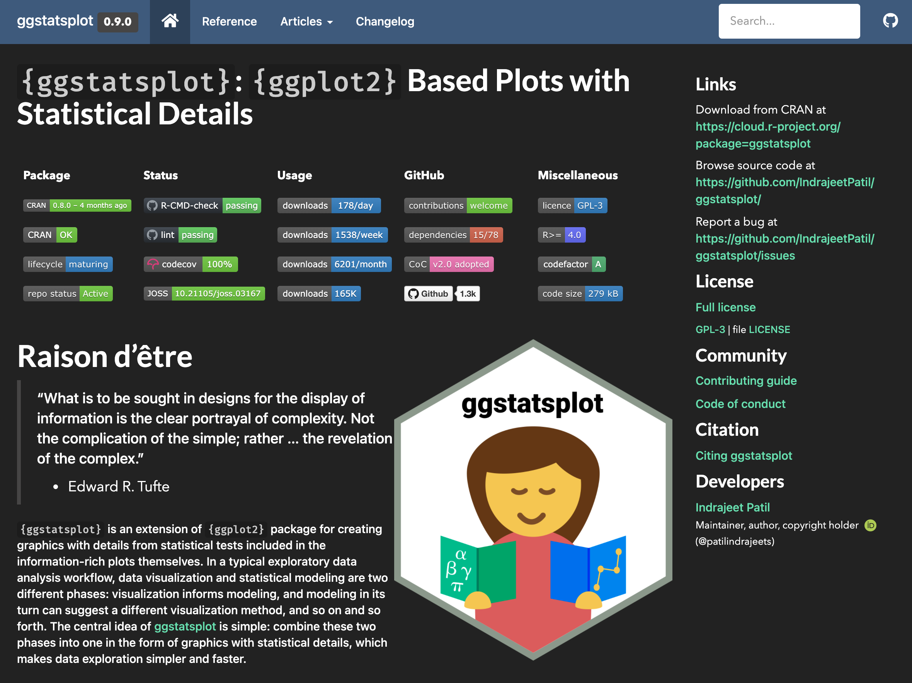
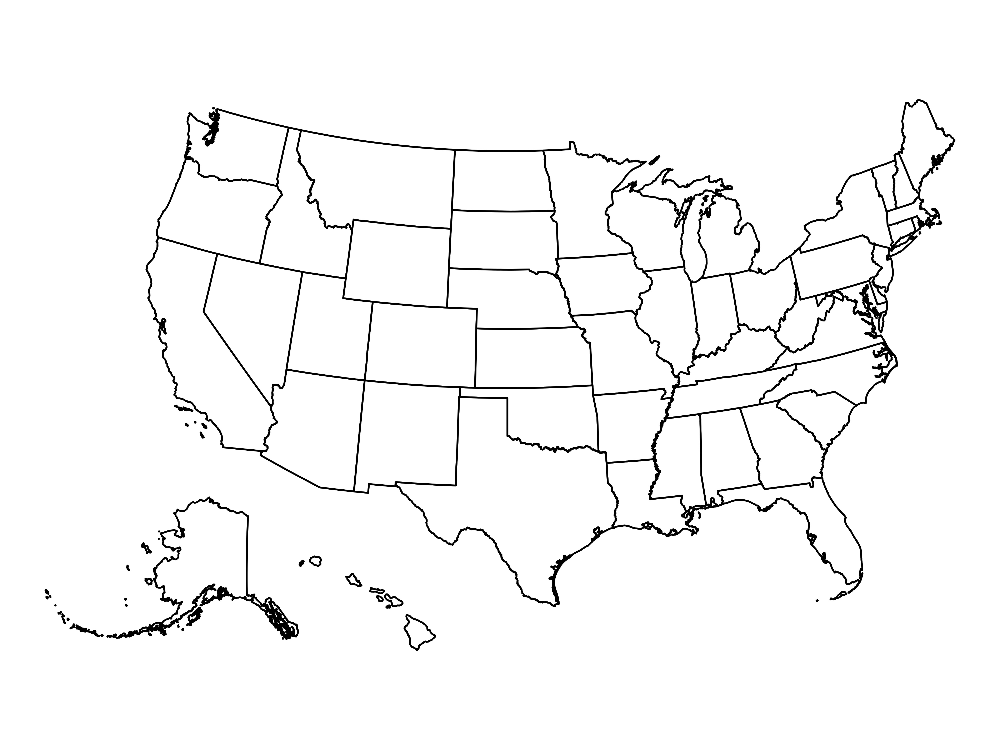
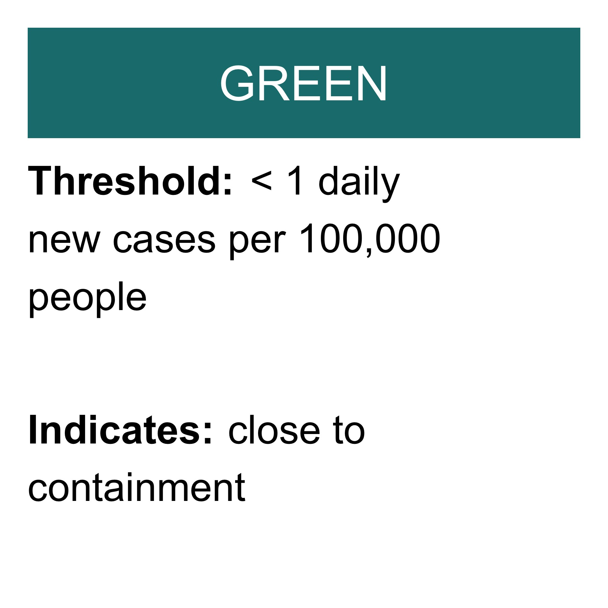
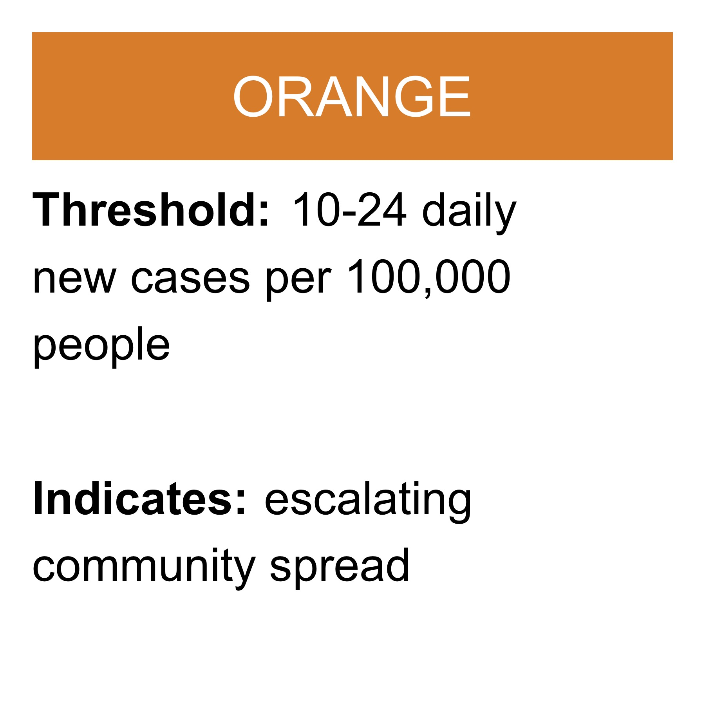
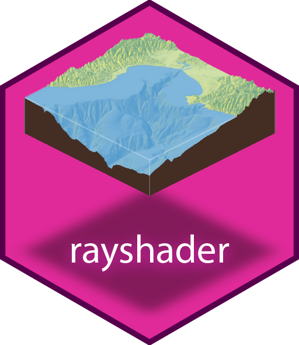
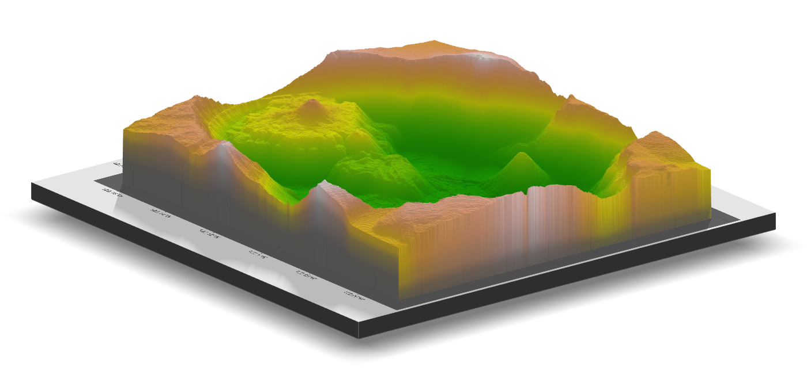
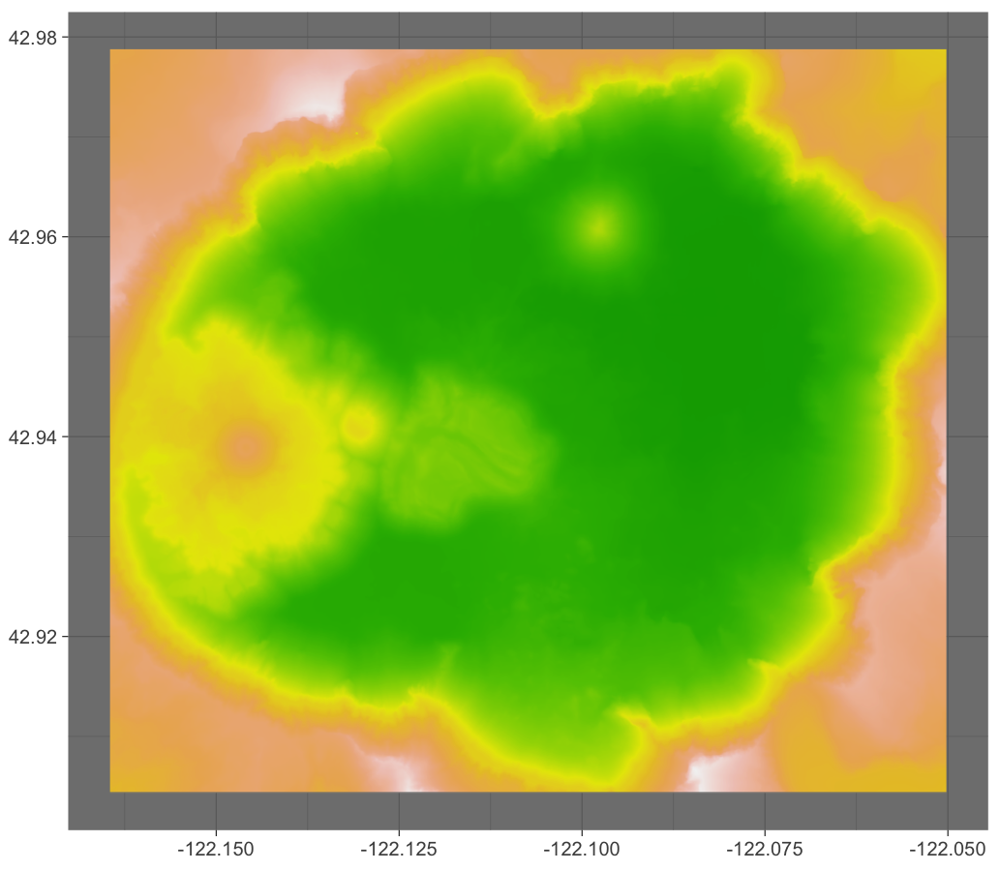
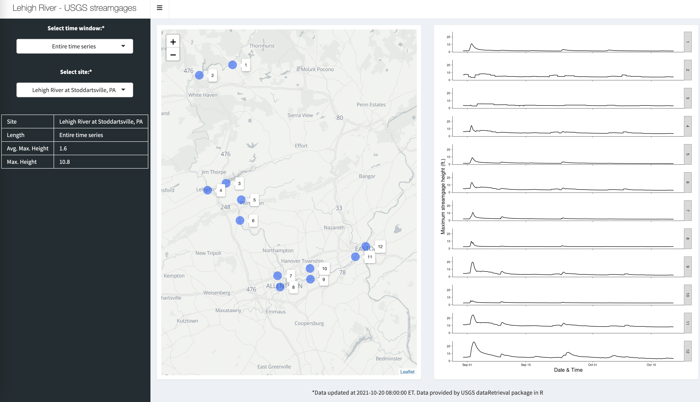

class: center, middle, inverse, title-slide

## Data Visualization with R
#### Jeremy Mack
#### Lehigh University - Digital Scholarship Team


---
class: center, middle, inverse, title-slide

## Data Visualization with R
#### Jeremy Mack
#### Lehigh University - Digital Scholarship Team
 &nbsp;  &nbsp; 
<br/><br/>
<br/><br/>
<br/>

---
### About this presentation

 * This seminar is the second in a series on R programming, with
   a focus on **data visualization**.

--
 
 * It is targeted at people that have experience programming in R.
 
--
   
 * It could be useful for people who learned R some time ago and
   forgot it, or who are not familiar with modern R programming
   (`tidyverse`).
   
--
   
 * Slides are available on [Lehigh's Research Computing site](https://confluence.cc.lehigh.edu/display/hpc/Seminars) and Github ([slides](https://jeremymack-lu.github.io/rviz/) and [raw code](https://github.com/jeremymack-LU/rviz))

---
### Structure of the presentation

The presentation is split into four topics:

 * [**Topic 1:**](https://jeremymack-lu.github.io/rviz/#12) The (layered) Grammar of Graphics
 
 * [**Topic 2:**](https://jeremymack-lu.github.io/rviz/#26) Static visualizations
 
 * [**Topic 3:**](https://jeremymack-lu.github.io/rviz/#120) Dynamic visualizations
 
 * [**Topic 4:**](https://jeremymack-lu.github.io/rviz/#151) Shiny Apps - a preview

---
#### Data Visualization with R

<center></center>

---
#### Data Visualization with R

<center></center>

---
#### Data Visualization with R

<center></center>

---
#### Data Visualization with R

<center><b>“The simple graph has brought more information to the data analyst’s mind than any other device.” - John Tukey</b></center>
<br/>
<center></center>

---
class: center, middle, inverse

#### Topic 1: The (layered) Grammar of Graphics
<br/><br/>
<br/><br/>
<br/><br/>
<br/><br/>
<br/><br/>

---
#### Topic 1: The (layered) Grammar of Graphics
.pull-left2[
* *The Grammar of Gaphics*

* Structure of data graphics.

* Foundation for modern applications.
  + **ggplot2**
  
  + Tableau
  
  + Vega-Lite]

.pull-right2[
<center></center>]

---
#### Topic 1: The (layered) Grammar of Graphics
.pull-left2[
* Tidyverse - **ggplot2**

* Implementation of the grammar
]

.pull-right2[
<center></center>]

---
#### Topic 1: The (layered) Grammar of Graphics
.pull-left2[
* Tidyverse - **ggplot2**

* Implementation of the grammar

* Layered approach to building graphics
]

.pull-right2[
<center></center>]

---
#### Topic 1: The (layered) Grammar of Graphics
.pull-left2[
* Tidyverse - **ggplot2**

* Implementation of the grammar

* Layered approach to building graphics

 + Data creates the base (tidy format)
]

.pull-right2[
<center></center>]

---
#### Topic 1: The (layered) Grammar of Graphics
.pull-left2[
* Tidyverse - **ggplot2**

* Implementation of the grammar

* Layered approach to building graphics

 + <span style="color:lightgray">Data creates the base (tidy format)</span>

 + Link variables to graphical properties
]

.pull-right2[
<center></center>]

---
#### Topic 1: The (layered) Grammar of Graphics
.pull-left2[
* Tidyverse - **ggplot2**

* Implementation of the grammar

* Layered approach to building graphics

 + <span style="color:lightgray">Data creates the base (tidy format)</span>
 
 + <span style="color:lightgray">Link variables to graphical properties</span>

 + Transform data to displayed values
]

.pull-right2[
<center></center>]

---
#### Topic 1: The (layered) Grammar of Graphics
.pull-left2[
* Tidyverse - **ggplot2**

* Implementation of the grammar

* Layered approach to building graphics

 + <span style="color:lightgray">Data creates the base (tidy format)</span>

 + <span style="color:lightgray">Link variables to graphical properties</span>

 + <span style="color:lightgray">Transform data to displayed values</span>

 + Variable and property ranges
]

.pull-right2[
<center></center>]

---
#### Topic 1: The (layered) Grammar of Graphics
.pull-left2[
* Tidyverse - **ggplot2**

* Implementation of the grammar

* Layered approach to building graphics

 + <span style="color:lightgray">Data creates the base (tidy format)</span>

 + <span style="color:lightgray">Link variables to graphical properties</span>

 + <span style="color:lightgray">Transform data to displayed values</span>

 + <span style="color:lightgray">Variable and property ranges</span>

 + Graphical representation of the data
]

.pull-right2[
<center></center>]

---
#### Topic 1: The (layered) Grammar of Graphics
.pull-left2[
* Tidyverse - **ggplot2**

* Implementation of the grammar

* Layered approach to building graphics

 + <span style="color:lightgray">Data creates the base (tidy format)</span>

 + <span style="color:lightgray">Link variables to graphical properties</span>

 + <span style="color:lightgray">Transform data to displayed values</span>

 + <span style="color:lightgray">Variable and property ranges</span>

 + <span style="color:lightgray">Graphical representation of the data</span>

 + Creates "small multiples"
]

.pull-right2[
<center></center>]

---
#### Topic 1: The (layered) Grammar of Graphics
.pull-left2[
* Tidyverse - **ggplot2**

* Implementation of the grammar

* Layered approach to building graphics

 + <span style="color:lightgray">Data creates the base (tidy format)</span>

 + <span style="color:lightgray">Link variables to graphical properties</span>

 + <span style="color:lightgray">Transform data to displayed values</span>

 + <span style="color:lightgray">Variable and property ranges</span>

 + <span style="color:lightgray">Graphical representation of the data</span>

 + <span style="color:lightgray">Creates "small multiples"</span>
 
 + Sets unique position
]

.pull-right2[
<center></center>]

---
#### Topic 1: The (layered) Grammar of Graphics
.pull-left2[
* Tidyverse - **ggplot2**

* Implementation of the grammar

* Layered approach to building graphics

 + <span style="color:lightgray">Data creates the base (tidy format)</span>

 + <span style="color:lightgray">Link variables to graphical properties</span>

 + <span style="color:lightgray">Transform data to displayed values</span>

 + <span style="color:lightgray">Variable and property ranges</span>

 + <span style="color:lightgray">Graphical representation of the data</span>

 + <span style="color:lightgray">Creates "small multiples"</span>
 
 + <span style="color:lightgray">Sets unique position</span>
 
 + Defines the overall look of the plot
]

.pull-right2[
<center></center>]

---
#### Topic 1: The (layered) Grammar of Graphics
.pull-left2[
* Tidyverse - **ggplot2**

* Implementation of the grammar

* Layered approach to building graphics

 + Required arguments
 
 + Everything else has **sensible defaults**
]

.pull-right2[
<center></center>]

---
#### Topic 1: The (layered) Grammar of Graphics
.pull-left2[
* Tidyverse - **ggplot2**

* Implementation of the grammar

* Layered approach to building graphics
 + Required arguments
 
 + Everything else has **sensible defaults**
 
* Basic template has three functions:
  + **ggplot** - creates a blank canvas
  
  + **geom** - adds a layer
  
  + **aes** - visual properties of an object
]

.pull-right2[
<center></center>
<center></center>
]

---
class: center, middle, inverse

#### Topic 2: Static visualizations
#### "Old Faithful"
<br/><br/>
<br/><br/>
<br/><br/>
<br/><br/>
<br/><br/>

---
#### Topic 2: Static visualizations

.pull-right2[
<center></center>
]

.tiny2.pull-left2[
* Old Faithful dataset:

  + Geyser in Yellowstone National Park
  
  + Eruption time in minutes (*eruptions*)
  
  + Time until next eruption (*waiting*)
  {{content}}
]

--

```{r comment=NA}
head(faithful, 5)
```
{{content}}

```{r comment=NA}
str(faithful)
```
{{content}}

---
#### Topic 2: Static visualizations
.right-column2[
<center></center>
<center></center>
]

.left-column2[
* Layered approach to building graphics
```{r echo=FALSE, message=FALSE, warning=FALSE}
library(ggplot2)
```
.tiny[
```{r eval=FALSE}
# Create a blank ggplot canvas
ggplot(data=faithful)
```
]
]

---
#### Topic 2: Static visualizations

<center></center>

---
#### Topic 2: Static visualizations
.right-column2[
<center></center>
<center></center>
]

.left-column2[
* Layered approach to building graphics
```{r echo=FALSE, message=FALSE, warning=FALSE}
library(ggplot2)
```
.tiny[
```{r eval=FALSE}
# Create a blank ggplot canvas
ggplot(data=faithful)
```

```{r eval=FALSE}
# Add a geometric (geom) layer and map variables to aesthetics (aes) function
ggplot(data=faithful) +
geom_point(mapping=aes(x=eruptions,
                       y=waiting))
```
]
]

---
#### Topic 2: Static visualizations

<center></center>

---
#### Topic 2: Static visualizations
.right-column2[
<center></center>
<center></center>
]

.left-column2[
* Layered approach to building graphics

* Some things to remember:

 + Multiple ways to map variables
]

---
#### Topic 2: Static visualizations
.right-column2[
<center></center>
<center></center>
]

.tiny.left-column2[
* Split mappings:
```{r eval=FALSE}
ggplot(data=faithful) +
geom_point(mapping=aes(x=eruptions,
                       y=waiting))
```
{{content}}
]

--

* Mappings in **ggplot** function:
```{r eval=FALSE}
ggplot(data=faithful,
       mapping=aes(x=eruptions,
                   y=waiting)) +
geom_point()
```
{{content}}

--

* Mappings in **geom** function:
```{r eval=FALSE}
ggplot() +
geom_point(data=faithful,
           mapping=aes(x=eruptions,
                       y=waiting))
```
{{content}}

---
#### Topic 2: Static visualizations
.right-column2[
<center></center>
<center></center>
]

.left-column2[
* Layered approach to building graphics
```{r echo=FALSE, message=FALSE, warning=FALSE}
library(ggplot2)
```
.tiny[
```{r eval=FALSE}
# Create a blank ggplot canvas
ggplot(data=faithful)
```

```{r eval=FALSE}
# Add a geometric (geom) layer and map variables to aesthetics (aes) function
ggplot(data=faithful) +
geom_point(mapping=aes(x=eruptions,
                       y=waiting))
```

```{r eval=FALSE}
# Add another aesthetic
ggplot(data=faithful) +
geom_point(mapping=aes(x=eruptions,
                       y=waiting,
                       color=eruptions < 3))
```
]
]

---
#### Topic 2: Static visualizations

<center></center>

---
#### Topic 2: Static visualizations
.right-column2[
<center></center>
<center></center>
]

.left-column2[
* Layered approach to building graphics

* Some things to remember:

 + <span style="color:lightgray">Multiple ways to map variables</span>

 + Multiple ways to change aesthetics
]

---
#### Topic 2: Static visualizations
.right-column2[
<center></center>
<center></center>
]

.tiny.left-column2[
* Mapping a color:
```{r eval=FALSE}
ggplot(data=faithful) +
geom_point(mapping=aes(x=eruptions,
                       y=waiting,
                       color=eruptions < 3))
```
{{content}}
]

--

* Setting a color:
```{r eval=FALSE}
ggplot(data=faithful) +
geom_point(mapping=aes(x=eruptions,
                       y=waiting),
           color='blue')
```
{{content}}

---
#### Topic 2: Static visualizations

<center></center>

---
#### Topic 2: Static visualizations
.right-column2[
<center></center>
<center></center>
]

.tiny.left-column2[
* Mapping a color:
```{r eval=FALSE}
ggplot(data=faithful) +
geom_point(mapping=aes(x=eruptions,
                       y=waiting,
                       color=eruptions < 3))
```
* Setting a color:
```{r eval=FALSE}
ggplot(data=faithful) +
geom_point(mapping=aes(x=eruptions,
                       y=waiting),
           color='blue')
```
* Setting inside aes function?
```{r eval=FALSE}
ggplot(data=faithful) +
geom_point(mapping=aes(x=eruptions,
                       y=waiting,
                       color='blue'))
```
]

---
#### Topic 2: Static visualizations

<center></center>

---
#### Topic 2: Static visualizations
.right-column2[
<center></center>
<center></center>
]

.left-column2[
* Layered approach to building graphics

* Some things to remember:

 + <span style="color:lightgray">Multiple ways to map variables</span>

 + <span style="color:lightgray">Multiple ways to change aesthetics</span>
 
 + Aesthetics vary by geometry
]

---
#### Topic 2: Static visualizations

<center></center>

---
#### Topic 2: Static visualizations
.right-column2[
<center></center>
<center></center>
]

.tiny.left-column2[
* Mapping a color:
```{r eval=FALSE}
ggplot(data=faithful) +
geom_point(mapping=aes(x=eruptions,
                       y=waiting,
                       color=eruptions < 3))
```
{{content}}
]

--

* Adding aesthetics:
```{r eval=FALSE}
ggplot(data=faithful) +
    geom_point(mapping=aes(x=eruptions,
                           y=waiting,
                           color=eruptions < 3,
                           size=waiting),
               alpha=0.5)
```
{{content}}

---
#### Topic 2: Static visualizations

<center></center>

---
#### Topic 2: Static visualizations
.right-column2[
<center></center>
<center></center>
]

.left-column2[
* Layered approach to building graphics

* Some things to remember:

 + <span style="color:lightgray">Multiple ways to map variables</span>
 
 + <span style="color:lightgray">Multiple ways to change aesthetics</span>
 
 + <span style="color:lightgray">Aesthetics vary by geometry</span>
 
 + When stacking layers, order matters
]

---
#### Topic 2: Static visualizations

.right-column2[
<center></center>
<center></center>
]

.tiny.left-column2[
* Add another geom ("stacking layers"):
```{r eval=FALSE}
ggplot(data=faithful,
       mapping=aes(x=eruptions,
                   y=waiting)) +
geom_point() +
geom_smooth(method="lm")
```
]

---
#### Topic 2: Static visualizations

<center></center>

---
#### Topic 2: Static visualizations

.right-column2[
<center></center>
<center></center>
]

.tiny.left-column2[
* Add another geom ("stacking layers"):
```{r eval=FALSE}
ggplot(data=faithful,
       mapping=aes(x=eruptions,
                   y=waiting)) +
geom_point() +
geom_smooth(method="lm")
```
{{content}}
]

--

* Order matters
```{r eval=FALSE}
ggplot(data=faithful,
       mapping=aes(x=eruptions,
                   y=waiting)) +
geom_smooth(method="lm") +
geom_point()
```
{{content}}

---
#### Topic 2: Static visualizations

<center></center>

---
#### Topic 2: Static visualizations
.right-column2[
<center></center>
<center></center>
]

.left-column2[
* Layered approach to building graphics

* Some things to remember:

 + <span style="color:lightgray">Multiple ways to map variables</span>
 
 + <span style="color:lightgray">Multiple ways to change aesthetics</span>
 
 + <span style="color:lightgray">Aesthetics vary by geometry</span>
 
 + <span style="color:lightgray">When stacking layers, order matters</span>
 
 + Many types of geoms, different mapping requirements
]

---
#### Topic 2: Static visualizations

<center></center>

---
#### Topic 2: Static visualizations
.right-column2[
<center></center>
<center></center>
]

.left-column2[
* Layered approach to building graphics

* Some things to remember:

 + <span style="color:lightgray">Multiple ways to map variables</span>
 
 + <span style="color:lightgray">Multiple ways to change aesthetics</span>
 
 + <span style="color:lightgray">Aesthetics vary by geometry</span>
 
 + <span style="color:lightgray">When stacking layers, order matters</span>
 
 + <span style="color:lightgray">Many types of geoms, different mapping requirements</span>
 
 + Many (many!) theme arguments
]

---
#### Topic 2: Static visualizations

.right-column2[
<center></center>
<center></center>
]

.tiny2.left-column2[
* Layered approach to building graphics
```{r eval=FALSE}
# Create overall plot object
plot <- ggplot(data=faithful,
               mapping=aes(x=eruptions,
                           y=waiting)) +
geom_smooth(method="lm") +
geom_point(size=0.25)
```
{{content}}
]

--

```{r eval=FALSE}
# Clean up overall plot theme
plot <- plot +
  theme(plot.background=element_blank(),
        panel.border=element_blank(),
        panel.background=element_blank(),
        axis.ticks=element_line(size=0.25),
        axis.text=element_text(size = 7),
        axis.line=element_line(size=0.25),
        axis.title=element_text(size = 7),
        legend.text=element_text(size = 7),
        legend.title=element_text(size = 7),
        legend.key=element_blank(),
        plot.title=element_text(hjust=.5, size=8)) +
    labs(title="Old Faithful Waiting Time",
         x="Length of eruption (minutes)",
         y="Waiting time to next eruption (minutes)")
```
{{content}}

---
#### Topic 2: Static visualizations

<center></center>

---
class: center, middle, inverse

#### Topic 2: Static visualizations
#### ggplot2 extensions
<br/><br/>
<br/><br/>
<br/><br/>
<br/><br/>
<br/><br/>

---
#### Topic 2: Static visualizations
.right-column2[
<center>
]

.left-column2[
* **ggplot2** extensions

* Extends the grammar of graphics

 + Developed by R users
  
 + Provides additional [functionality](<http://exts.ggplot2.tidyverse.org/gallery/>)
]

---
#### Topic 2: Static visualizations
.right-column2[
<center>
]

.left-column2[
* **ggplot2** extensions - **patchwork**

* Extends the grammar of graphics

 + Arrange multiple plots, using mathematical operators
  
 + Many approaches
     - Facets
     - gridExtra::grid.arrange()
     - ggpubr::ggarrange()
     - cowplot::plot_grid()
     - patchwork
]

---
#### Topic 2: Static visualizations
.tiny.left-column3[
* Establish plots:
```{r eval=FALSE}
library(patchwork)

pw1 <- ggplot(data=faithful,
              mapping=aes(x=eruptions,
                          y=waiting)) +
  geom_point()

pw2 <- ggplot(data=faithful,
              mapping=aes(x=eruptions,
                          y=waiting)) +
  geom_point() +
  geom_smooth(method="lm")
```
]

--

.tiny.right-column3[
* Patchwork together:
```{r eval=FALSE}
# Side by side
pw1 + pw2
```
{{content}}
]

---
#### Topic 2: Static visualizations

<center></center>

---
#### Topic 2: Static visualizations
.tiny.left-column3[
* Establish plots:
```{r eval=FALSE}
library(patchwork)

pw1 <- ggplot(data=faithful,
              mapping=aes(x=eruptions,
                          y=waiting)) +
  geom_point()

pw2 <- ggplot(data=faithful,
              mapping=aes(x=eruptions,
                          y=waiting)) +
  geom_point() +
  geom_smooth(method="lm")
```
]

.tiny.right-column3[
* Patchwork together:
```{r eval=FALSE}
# Side by side
pw1 + pw2

# Stacked
pw1 / pw2
```
{{content}}
]

---
#### Topic 2: Static visualizations

<center></center>

---
#### Topic 2: Static visualizations
.tiny.left-column3[
* Establish plots:
```{r eval=FALSE}
library(patchwork)

pw1 <- ggplot(data=faithful,
              mapping=aes(x=eruptions,
                          y=waiting)) +
  geom_point()

pw2 <- ggplot(data=faithful,
              mapping=aes(x=eruptions,
                          y=waiting)) +
  geom_point() +
  geom_smooth(method="lm")

pw3 <- ggplot(data=faithful,
              mapping=aes(x=eruptions)) +
  geom_histogram()
```
]

.tiny.right-column3[
* Patchwork together:
```{r eval=FALSE}
# Side by side
pw1 + pw2

# Stacked
pw1 / pw2

# Three figures
(pw1 + pw2) / pw3
```
{{content}}
]

---
#### Topic 2: Static visualizations

<center></center>

---
#### Topic 2: Static visualizations

<center></center>

---
#### Topic 2: Static visualizations
.tiny.left-column3[
* Establish plots:
```{r eval=FALSE}
library(patchwork)

pw1 <- ggplot(data=faithful,
              mapping=aes(x=eruptions,
                          y=waiting)) +
  geom_point()

pw2 <- ggplot(data=faithful,
              mapping=aes(x=eruptions,
                          y=waiting)) +
  geom_point() +
  geom_smooth(method="lm")
```
]

.tiny.right-column3[
* Patchwork together:
```{r eval=FALSE}
# Side by side
pw1 + pw2
```
]

---
#### Topic 2: Static visualizations
.tiny.left-column3[
* Establish plots:
```{r eval=FALSE}
library(patchwork)

pw1 <- ggplot(data=faithful,
              mapping=aes(x=eruptions,
                          y=waiting)) +
  geom_point()

pw2 <- ggplot(data=faithful,
              mapping=aes(x=eruptions,
                          y=waiting)) +
  geom_point() +
  geom_smooth(method="lm")
```
]

.tiny.right-column3[
* Patchwork together:
```{r eval=FALSE}
# Side by side
pw1 + pw2 + plot_layout(widths=c(2,1))
```
]

---
#### Topic 2: Static visualizations

<center></center>

---
#### Topic 2: Static visualizations
.tiny.left-column3[
* Establish plots:
```{r eval=FALSE}
library(patchwork)

pw1 <- ggplot(data=faithful,
              mapping=aes(x=eruptions,
                          y=waiting)) +
  geom_point()

pw2 <- ggplot(data=faithful,
              mapping=aes(x=eruptions,
                          y=waiting)) +
  geom_point() +
  geom_smooth(method="lm")
```
]

.tiny.right-column3[
* Patchwork together:
```{r eval=FALSE}
# Side by side
pw1 + pw2
```
{{content}}
]

--

```{r eval=FALSE}
library(grid); library(gridExtra) 

# Remove axis title
pw1 <- pw1 +
  theme(axis.title=element_blank())
pw2 <- pw2 +
  theme(axis.title=element_blank())

# Patch together and create a 'grob' object
patch    <- pw1 + pw2
patch.gr <- patchworkGrob(patch)

# Add grid text
grid.arrange(patch.gr, 
  left=textGrob("Time until next eruption",
       gp=gpar(fontsize=8), rot=90),
  bottom=textGrob("Length of eruption",
         gp=gpar(fontsize=8)))
```
{{content}}

---
#### Topic 2: Static visualizations

<center></center>

---
#### Topic 2: Static visualizations
.right-column2[
<center>
]

.left-column2[
* **ggplot2** extensions - **ggforce/ggthemes**

* Extends the grammar of graphics

 + Provides extra geoms, scales, and themes
]
  
---
#### Topic 2: Static visualizations
.right-column2[
<center>
]

.tiny.left-column2[
* **ggplot2** extensions - **ggforce/ggthemes**

* Extends the grammar of graphics

 + Provides extra geoms, scales, and themes
 
 + Microsoft Excel theme
```{r eval=FALSE}
library(ggthemes)

ggplot(data=faithful) +
geom_point(mapping=aes(
             x=eruptions,
             y=waiting),
             color='blue') +
theme_excel()
```
]

---
#### Topic 2: Static visualizations

<center></center>

---
#### Topic 2: Static visualizations
.right-column2[
<center>
]

.tiny.left-column2[
* **ggplot2** extensions - **ggforce/ggthemes**

* Extends the grammar of graphics

 + Provides extra geoms, scales, and themes
 
 + Microsoft Excel theme
 
 + Wall Street Journal theme
```{r eval=FALSE}
library(ggthemes)

ggplot(data=faithful) +
geom_point(mapping=aes(
             x=eruptions,
             y=waiting),
             color='blue') +
#theme_excel()
theme_wsj()
```
]

---
#### Topic 2: Static visualizations

<center></center>

---
#### Topic 2: Static visualizations
.right-column2[
<center>
]

.tiny.left-column2[
* **ggplot2** extensions - **ggforce/ggthemes**

* Extends the grammar of graphics

 + Provides extra geoms, scales, and themes
 
 + Microsoft Excel theme
 
 + Wall Street Journal theme
 
 + Google Docs theme
```{r eval=FALSE}
library(ggthemes)

ggplot(data=faithful) +
geom_point(mapping=aes(
             x=eruptions,
             y=waiting),
             color='blue') +
#theme_excel()
#theme_wsj()
theme_gdocs()
```
]

---
#### Topic 2: Static visualizations

<center></center>

---
#### Topic 2: Static visualizations
.right-column2[
<center>
]

.tiny.left-column2[
* **ggplot2** extensions - **ggstatsplot**

* Extends the grammar of graphics

 + Quickly combine plots with statistics
 {{content}}
]

--

```{r eval=FALSE}
ggscatterstats(
  data=faithful,
  x=eruptions,
  y=waiting,
  xlab="Length of eruption",
  ylab="Time until next eruption",
  title="How long until Old Faithful erupts?")
```

---
#### Topic 2: Static visualizations

<center></center>

---
#### Topic 2: Static visualizations

[<center></center>](https://indrajeetpatil.github.io/ggstatsplot/)

---
class: center, middle, inverse

#### Topic 2: Static visualizations
#### ggplot2 and simple features (sf) data
<br/><br/>
<br/><br/>
<br/><br/>
<br/><br/>
<br/><br/>

---
#### Topic 2: Static visualizations
.right-column2[
<center>
]

.left-column2[
* Simple features (**sf**) data

* Introduces a new type of object to work with spatial data
{{content}}
]
  
---
#### Topic 2: Static visualizations
<style>
  pre {
    background-color: lightyellow;
    white-space: pre-wrap;
    line-height: 90%;
  }
</style>
.right-column2[
<center>
]

.left-column2[
* Simple features (**sf**) data

* Introduces a new type of object to work with spatial data

 + Non-spatial data + Spatial data

 + Attributes + Geometries
]

---
class: center, middle, inverse

#### Comparison of sf and non-sf spatial data
<br/><br/>
<br/><br/>
<br/><br/>
<br/><br/>
<br/><br/>

---
#### Topic 2: Static visualizations
.left-column5b[
* Spatial data in a data frame
```{r include=FALSE}
library(usmap)
library(ggplot2)
library(dplyr)
```

.tiny7[
```{r}
library(usmap) # State and county data non-sf
non_sf <- us_map(regions="states"); head(non_sf, 5); str(non_sf)
```
]
]

--

.right-column5b[
* Plot of Pennsylvania
```{r include=FALSE}
library(usmap)
library(ggplot2)
library(dplyr)
```

.tiny7[
```{r eval=FALSE}
non_sf %>% 
  filter(abbr=="PA") %>%
  ggplot() +
  geom_point(aes(x=x,y=y,group=group)) +
  geom_path(aes(x=x,y=y,group=group)) +
  coord_fixed() +
  ggthemes::theme_map()
```
]
<center></center>
]

---
#### Topic 2: Static visualizations
.left-column5b[
* Spatial data in an sf object
```{r include=FALSE}
library(usmap)
library(ggplot2)
library(dplyr)
```

.tiny7[
```{r}
library(urbnmapr) # State and county shapefiles in sf
states_sf <- get_urbn_map("states", sf = TRUE); print(states_sf)
```
]
]

--

.right-column5b[
* Plot of Pennsylvania
```{r include=FALSE}
library(usmap)
library(ggplot2)
library(dplyr)
```

.tiny7[
```{r eval=FALSE}
states_sf %>%
    filter(state_abbv=='PA') %>%
    ggplot() +
    geom_sf() +
    ggthemes::theme_map()
```
]
<center></center>
]

---
#### Topic 2: Static visualizations
.left-column5[
* Spatial data in a data frame
```{r echo=FALSE}
library(usmap)
```

.tiny7[
```{r}
library(usmap) # State and county data non-sf
non_sf <- us_map(regions="states"); head(non_sf, 5); str(non_sf)
```
]
]

.right-column5[
* Spatial data in an sf object
```{r echo=FALSE}
library(urbnmapr)
```

.tiny7[
```{r}
library(urbnmapr) # State and county shapefiles in sf
states_sf <- get_urbn_map("states", sf = TRUE); print(states_sf)
```
]
]

---
#### Topic 2: Static visualizations

<center></center>

---
#### Topic 2: Static visualizations

.pull-right2[
<center>
]

.tiny2.pull-left2[
Necessary datasets:

 * Spatial data: state boundaries
  
 * Non-spatial data: cases of COVID-19
 
 * Non-spatial data: state populations
]

---
#### Topic 2: Static visualizations
.right-column2[
<center>
]

.left-column2[
* Spatial data: state boundaries
```{r echo=FALSE}
library(urbnmapr)
```

.tiny5[
```{r}
library(urbnmapr) # State and county shapefiles in sf
states.sf <- get_urbn_map("states", sf = TRUE)
print(states.sf)
```
]
]

---
#### Topic 2: Static visualizations
.tiny5.left-column3[
* Non-spatial data: cases
```{r include=FALSE}
library(readr)
ts <- "https://raw.githubusercontent.com/jeremymack-LU/rviz/master/data/us_covid_ts.csv"
ts <- read_csv(ts)
head(ts)
```

```{r eval=FALSE}
ts <- "https://raw.githubusercontent.com/jeremymack-LU/rviz/master/data/us_covid_ts.csv"
ts <- read_csv(ts)
head(ts)
```

```{r echo=FALSE}
head(ts)
```
]

.tiny5.right-column3[
* Non-spatial data: state populations
```{r include=FALSE}
library(dplyr)
pop <- "https://raw.githubusercontent.com/jeremymack-LU/rviz/master/data/population.csv"
pop <- read_csv(pop)
```

```{r eval=FALSE}
pop <- "https://raw.githubusercontent.com/jeremymack-LU/rviz/master/data/population.csv"
pop <- read_csv(pop)
head(pop)
```

```{r echo=FALSE}
head(pop)
```

```{r}
names(pop)[1] <- "state_name"
head(pop, 2)
```

]

---
#### Topic 2: Static visualizations
.left-column2[
* Merge cases and population datasets
]
<br/><br/>
.tiny5[
```{r message=FALSE}
# Combine data frames
df.us <- ts %>%
  group_by(state_name) %>%
  arrange(date) %>%
  # Select most recent date
  slice(n()) %>%
  left_join(pop, by="state_name") %>%
  # Calculate per capita rate
  mutate(new7b=round(new7/(population/100000),1))
# View top of data frame
head(df.us)
```
]

---
#### Topic 2: Static visualizations
.left-column2[
* Merge attributes and geometries
]
<br/><br/>
.tiny5[
```{r include=FALSE}
states.sf <- states.sf %>% 
  right_join(df.us, by="state_name")
```

```{r eval=FALSE}
# Combine data frames
states.sf <- states.sf %>% 
  right_join(df.us, by="state_name")
# View top of data frame
head(states.sf)
```
]

.tiny5[
```{r message=FALSE, echo=FALSE}
states.sf$new7 <- round(states.sf$new7,1)
head(states.sf,5)
```
]

---
#### Topic 2: Static visualizations

.pull-right2[
<center>
]

.tiny2.pull-left2[
Necessary datasets:
 * Spatial data: state boundaries
  
 * Non-spatial data: cases of COVID-19
 
 * Non-spatial data: state populations
{{content}}
]

--

<br/>

Parts of the plot:
  
 * Map
 
 * Legend (custom)
  {{content}}

---
#### Topic 2: Static visualizations

.left-column2[
* Parts of the plot: Map
]
<br/><br/>

.tiny2[
```{r eval=FALSE}
# Create bins based on incidence value
states.sf <- states.sf %>%
  mutate(bin2=case_when(
        new7b < 1 ~ "A",
        new7b >= 1  & new7b < 10 ~ "B",
        new7b >= 10 & new7b < 25 ~ "C",
        TRUE ~ "D"))
# Custom colors (Green, Yellow, Orange, and Red)
cols <- c("A"="#197d7d", "B"="#dbc037", "C"="#e08f38", "D"="#8C1111")
# Create map
usa <- ggplot() +
  geom_sf(data=states.sf, aes(fill=bin),
          size=0.25, color="white") +
  scale_fill_manual(values=cols) +
  theme_void() +
  theme(legend.position="none",
        text=element_text(color="#22211d"),
        plot.background=element_rect(fill="white", color=NA),
        panel.background=element_rect(fill="white", color=NA))
```
]

---
#### Topic 2: Static visualizations

<center></center>

---
#### Topic 2: Static visualizations

.left-column8[
* Parts of the plot: Map - updated coordinate reference system (CRS)
]
<br/><br/>

.tiny2[
```{r eval=FALSE}
# Create map
usa2 <- ggplot() +
  geom_sf(data=states.sf, aes(fill=bin),
          size=0.25, color="white") +
  scale_fill_manual(values=cols) +
# Update the coordinate reference system
  coord_sf(crs=st_crs(3857)) +
  theme_void() +
  theme(legend.position="none",
        text=element_text(color="#22211d"),
        plot.background=element_rect(fill="white", color=NA), 
        panel.background=element_rect(fill="white", color=NA))
```
]

---
#### Topic 2: Static visualizations

<center></center>

---
#### Topic 2: Static visualizations
.left-column2[
* Parts of the plot: Legend (custom)
]
<br/><br/>

.tiny2[
```{r eval=FALSE}
# Create a legend item as another plot using annotate
leg.R <- ggplot() +
  annotate(geom="rect", xmin=0, xmax=2, ymin=1.8, ymax=2, color=NA, fill="#8C1111") +
  annotate(geom="text", label="RED", x=1, y=1.9, color="white", size=3) +
  annotate(geom="text",
           label="Threshold:",
           x=0, hjust=0, y=1.75, vjust=1, size=2.5, fontface="bold") +
  annotate(geom="text",
           label="                    25+ daily\nnew cases per 100,000\npeople",
           x=0, hjust=0, y=1.75, vjust=1, size=2.5) +
  annotate(geom="text",
           label="Indicates:",
           x=0, hjust=0, y=1.3, vjust=1, size=2.5, fontface="bold") +
  annotate(geom="text",
           label="                  unchecked\ncommunity spread",
           x=0, hjust=0, y=1.3, vjust=1, size=2.5) +
  scale_y_continuous(limits=c(1,2)) +
  theme_void() +
  theme(text=element_text(color="#22211d"),
        plot.background=element_rect(fill="white", color=NA),
        panel.background=element_rect(fill="white", color=NA),
        legend.background=element_rect(fill="white", color=NA))
```
]

---
#### Topic 2: Static visualizations






---
#### Topic 2: Static visualizations

.left-column8[
* Combining parts of the plot using patchwork
]
<br/><br/>

.tiny2[
```{r eval=FALSE}
# Create a legend item as another plot using annotate
usa2 + (leg.G/leg.Y/leg.O/leg.R) + 
  plot_layout(widths = c(4, 1)) + 
  plot_annotation(
    title='Which Places Have The Most New Daily Cases?',
    subtitle=paste("Data as of 11:59 p.m. ET", Sys.Date()-1)) & 
  theme(plot.title=element_text(size= 12, hjust=0.5, color="#4e4d47",
                                margin=margin(b = -0.1, t = 0.4, l = 2, unit = "cm")),
        plot.subtitle=element_text(size=8, hjust=0.5, color="#4e4d47", face="italic",
                                   margin=margin(b = -0.1, t = 0.4, l = 2, unit = "cm")))
```
]

---
#### Topic 2: Static visualizations

<center></center>

---
#### Topic 2: Static visualizations

<center></center>

---
class: inverse

#### Review - Grammar of Graphics & Static Visualizations:
* Grammar of graphics - basis for many data visualization programs.

--

* **ggplot2** is a popular implementation.

 * Layered approach with sensible defaults.
 
 
   <center></center>

--

* Extension packages expand **ggplot2** capabilities.

--

* **sf** data makes working with spatial data more efficient.

---
class: center, middle, inverse

#### Topic 3: Dynamic visualizations
#### "Life expectency"
<br/><br/>
<br/><br/>
<br/><br/>
<br/><br/>
<br/><br/>

---
#### Topic 3: Dynamic visualizations
.pull-right2[
<center></center>
]

.tiny2.pull-left2[
* Life expectency (**gapminder**) dataset:

  + Data from the Gapminder foundation
  
  + Geography (*country* and *continent*)
  
  + Life expectency (*lifeExp*)
  
  + Economic data (*gdpPercap*)
  
  + Time (*year*)
]

---
#### Topic 3: Dynamic visualizations
.pull-right2[
<center></center>
]

.pull-left2[
* Life expectency (**gapminder**) dataset:

  + Data from the Gapminder foundation
  
  + Geography (*country* and *continent*)
  
  + Life expectency (*lifeExp*)
  
  + Economic data (*gdpPercap*)
  
  + Time (*year*)
]

<br/><br/>
<br/><br/>
<br/><br/>
<br/><br/>
<br/><br/>
<br/><br/>

.tiny3[
```{r echo=FALSE}
library(gapminder)
```

```{r comment=NA}
str(gapminder)
```
]

---
#### Topic 3: Dynamic visualizations

<center></center>

---
#### Topic 3: Dynamic visualizations
.right-column2[
<center>
]

.left-column2[
* **ggplot2** extensions - **gganimate**

* Extends the grammar of graphics
{{content}}
]

--

  + New grammar classes (functions)
  
  + How a plot should change with time
  {{content}}

---
#### Topic 3: Dynamic visualizations
.tiny[
```{r eval=FALSE}
# Use the gapminder dataset in ggplot
ggplot(data=gapminder,
       aes(x=gdpPercap, y=lifeExp, size=pop, color=country)) +
# Add a point geom
 geom_point(alpha=0.7, show.legend=FALSE)
```
]

---
#### Topic 3: Dynamic visualizations

<center></center>

---
#### Topic 3: Dynamic visualizations
.tiny[
```{r eval=FALSE}
# Use the gapminder dataset in ggplot
ggplot(data=gapminder,
       aes(x=gdpPercap, y=lifeExp, size=pop, color=country)) +
  # Add a point geom
 geom_point(alpha=0.7, show.legend=FALSE) +
```

```{r eval=FALSE}
# Add some manual scaling and facets 
 scale_colour_manual(values=country_colors) +
 scale_size(range=c(2, 12)) +
 scale_x_log10() +
 facet_wrap(~continent, nrow=1)
```
]

---
#### Topic 3: Dynamic visualizations

<center></center>

---
#### Topic 3: Dynamic visualizations
.tiny[
```{r eval=FALSE}
# Use the gapminder dataset in ggplot
ggplot(data=gapminder,
       aes(x=gdpPercap, y=lifeExp, size=pop, color=country)) +
# Add a point geom
 geom_point(alpha=0.7, show.legend=FALSE) +
```

```{r eval=FALSE}
# Add some manual scaling and facets
 scale_colour_manual(values=country_colors) +
 scale_size(range=c(2, 12)) +
 scale_x_log10() +
 facet_wrap(~continent, nrow=1) +
```

```{r eval=FALSE}
# Animate figure with gganimate package
 transition_time(year) +
 ease_aes('linear') +
 labs(title='Year: {frame_time}', 
      x='GDP per capita', 
      y='Life expectancy')
```
]

---
#### Topic 3: Dynamic visualizations

<center></center>

---
class: center, middle, inverse

#### Topic 3: Dynamic visualizations
#### ggplot2 integrations
<br/><br/>
<br/><br/>
<br/><br/>
<br/><br/>
<br/><br/>

---
#### Topic 3: Dynamic visualizations
.right-column2[
<center>
]

.left-column2[
* **ggplot2** integrations

* Integrate with ggplot2 objects

 + Used as required arguments

]

---
#### Topic 3: Dynamic visualizations
.right-column2[
<center>
]

.left-column2[
* **ggplot2** integrations - **plotly**

* Extends the grammar of graphics

  + Creates interactive web graphics
  
  + Customizable user interface
]

---
#### Topic 3: Dynamic visualizations

```{r include=FALSE}
library(gapminder)
```

.tiny2[
```{r echo=FALSE, warning=FALSE, message=FALSE, comment=NA}
library(plotly)
library(widgetframe)
theme <- theme(panel.background=element_rect(color="black", fill="lightyellow", size=0.25),
               panel.grid=element_blank(),
               plot.title=element_text(size=9, color="black"),
               strip.background=element_rect(color="black", size=0.25),
               axis.ticks=element_line(size=0.25),
               axis.text=element_text(size=7, color="black"),
               axis.title=element_text(size=8, color="black"),
               legend.title=element_text(size=8, color="black"),
               legend.text=element_text(size=7, color="black"),
               legend.justification="top",
               legend.key=element_rect(color="black", fill="lightyellow", size=0.1))

p9 <- ggplot(data=gapminder, 
             aes(x=gdpPercap, y=lifeExp, size=pop, color=continent)) +
  # Add a point geom
  geom_point(alpha=0.7, show.legend=FALSE, aes(frame = year, ids = country)) +
  # Add some manual scaling
  scale_colour_manual(values=continent_colors) +
  scale_size(range=c(2, 12)) +
  scale_x_log10() +
  labs(x='GDP per capita', 
       y='Life expectancy at birth') +
  theme

fig <- ggplotly(p9, height=500, width=750) %>%
  animation_opts(
    1000, easing = "linear", redraw = FALSE) %>%
  animation_slider(
    currentvalue=list(prefix="YEAR ",
                      font=list(color="red"),
                      xanchor='left',
                      yanchor='top')) %>%
  animation_button(
    x = 1, xanchor = "right", y = -0.2, yanchor = "bottom"
  )

frameWidget(fig, height=500, width=750)
```
]

---
#### Topic 3: Dynamic visualizations

.tiny2.left-column5b[
* Create ggplot object

```{r eval=FALSE}
pacman::p_load(gapminder,plotly)
plot <- ggplot(data=gapminder, 
             aes(x=gdpPercap, y=lifeExp, size=pop,
                 color=continent)) +
  # Add a point geom
  geom_point(alpha=0.7, show.legend=FALSE,
             aes(frame = year, ids = country)) +
  # Add some manual scaling
  scale_colour_manual(values=continent_colors) +
  scale_size(range=c(2, 12)) +
  scale_x_log10() +
  labs(x='GDP per capita', 
       y='Life expectancy at birth')
```
]

.tiny2.right-column5b[]

---
#### Topic 3: Dynamic visualizations

<center></center>

---
#### Topic 3: Dynamic visualizations

.tiny2.left-column5b[
* Create ggplot object

```{r eval=FALSE}
pacman::p_load(gapminder,plotly)
plot <- ggplot(data=gapminder, 
             aes(x=gdpPercap, y=lifeExp, size=pop,
                 color=continent)) +
  # Add a point geom
  geom_point(alpha=0.7, show.legend=FALSE,
             aes(frame = year, ids = country)) +
  # Add some manual scaling
  scale_colour_manual(values=continent_colors) +
  scale_size(range=c(2, 12)) +
  scale_x_log10() +
  labs(x='GDP per capita', 
       y='Life expectancy at birth')
```
]

.tiny2.right-column5b[
* Pass to plotly

```{r eval=FALSE}
fig <- ggplotly(plot, height=500, width=750) %>%
  animation_opts(
    1000, easing = "linear", redraw = FALSE) %>%
  animation_slider(
    currentvalue=list(prefix="YEAR ",
                      font=list(color="red"),
                      xanchor='left',
                      yanchor='top')) %>%
  animation_button(x=1,
                   xanchor="right",
                   y=-0.2,
                   yanchor="bottom"
  )
```
]

---
#### Topic 3: Dynamic visualizations

```{r echo=FALSE, warning=FALSE, message=FALSE, comment=NA}
library(plotly)
library(widgetframe)
theme <- theme(panel.background=element_rect(color="black", fill="lightyellow", size=0.25),
               panel.grid=element_blank(),
               plot.title=element_text(size=9, color="black"),
               strip.background=element_rect(color="black", size=0.25),
               axis.ticks=element_line(size=0.25),
               axis.text=element_text(size=7, color="black"),
               axis.title=element_text(size=8, color="black"),
               legend.title=element_text(size=8, color="black"),
               legend.text=element_text(size=7, color="black"),
               legend.justification="top",
               legend.key=element_rect(color="black", fill="lightyellow", size=0.1))

p9 <- ggplot(data=gapminder, 
             aes(x=gdpPercap, y=lifeExp, size=pop, color=continent)) +
  # Add a point geom
  geom_point(alpha=0.7, show.legend=FALSE, aes(frame = year, ids = country)) +
  # Add some manual scaling
  scale_colour_manual(values=continent_colors) +
  scale_size(range=c(2, 12)) +
  scale_x_log10() +
  labs(x='GDP per capita', 
       y='Life expectancy at birth') +
  theme

fig <- ggplotly(p9, height=500, width=750) %>%
  animation_opts(
    1000, easing = "linear", redraw = FALSE) %>%
  animation_slider(
    currentvalue=list(prefix="YEAR ",
                      font=list(color="red"),
                      xanchor='left',
                      yanchor='top')) %>%
  animation_button(
    x=1, xanchor="right", y=-0.2, yanchor="bottom"
  )

frameWidget(fig, height=500, width=750)
```

---
#### Topic 3: Dynamic visualizations

.right-column2[
<center>
]

.left-column2[
* **ggplot2** integrations - **rayshader**

* Extends the grammar of graphics

  + Translates ggplot2 objects into 3D
  
  + Models can be rotated and examined interactively
]

---
#### Topic 3: Dynamic visualizations

<center></center>

---
#### Topic 3: Dynamic visualizations

.tiny2.left-column7[
* Create ggplot object

```{r eval=FALSE, warning=FALSE, message=FALSE, comment=NA}
# Load necessary packages
pacman::p_load(tidyverse, raster, ggthemes, sp, sf,
               rasterVis, rayshader)
# Download raster dataset
url  <- "https://github.com/jeremymack-LU/rviz/blob/master/data/CRLA_DEM_fill2.tif?raw=true"
download.file(url, "CRLA_DEM_fill2.tif")
# Load raster dataset and convert to a data frame
r    <- raster("data/CRLA_DEM_fill2.tif")
r.df <- as.data.frame(r, xy=TRUE)
# Create ggplot2 object
r.plot <- ggplot() +
    geom_raster(data=r.df,
                aes(x=x, y=y, fill=CRLA_DEM_fill2),
                interpolate=TRUE,
                show.legend=FALSE) +
    scale_fill_gradientn(name = "Elevation", colors=terrain.colors(10)) +
    coord_quickmap() +
    theme_dark(base_size=6) +
    theme(axis.title=element_blank())
```
]

.tiny2.right-column7[]

---
#### Topic 3: Dynamic visualizations

<center></center>

---
#### Topic 3: Dynamic visualizations

.tiny2.left-column7[
* Create ggplot object

```{r eval=FALSE, warning=FALSE, message=FALSE, comment=NA}
# Load necessary packages
pacman::p_load(tidyverse, raster, ggthemes, sp, sf,
               rasterVis, rayshader)
# Download raster dataset
url  <- "https://github.com/jeremymack-LU/rviz/blob/master/data/CRLA_DEM_fill2.tif?raw=true"
download.file(url, "CRLA_DEM_fill2.tif")
# Load raster dataset and convert to a data frame
r    <- raster("data/CRLA_DEM_fill2.tif")
r.df <- as.data.frame(r, xy=TRUE)
# Create ggplot2 object
r.plot <- ggplot() +
    geom_raster(data=r.df,
                aes(x=x, y=y, fill=CRLA_DEM_fill2),
                interpolate=TRUE,
                show.legend=FALSE) +
    scale_fill_gradientn(name = "Elevation", colors=terrain.colors(10)) +
    coord_quickmap() +
    theme_dark(base_size=6) +
    theme(axis.title=element_blank())
```
]

.tiny2.right-column7[
* Pass to rayshader

```{r eval=FALSE, warning=FALSE, message=FALSE, comment=NA}
# Pass ggplot2 object to rayshader function
plot_gg(r.plot,
        multicore=TRUE,
        width=5,
        height=5,
        scale=250,
        windowsize=c(1400,866),
        zoom=0.55,
        phi=30)
# Capture snapshot of the rgl window
render_snapshot(filename = "CRLA_3D",
                clear=TRUE)
```
]

---
#### Topic 3: Dynamic visualizations

<center></center>

---
#### Topic 3: Dynamic visualizations

.tiny2.left-column7[
* Create ggplot object
```{r eval=FALSE, warning=FALSE, message=FALSE, comment=NA}
# Load viridis package
library(viridis)
# Plot using mtcars dataset
gg_cars <- ggplot(mtcars) + 
    geom_point(aes(x=disp, color=wt, y=mpg), size=2) +
    scale_fill_viridis("Weight") +
    ggtitle("mtcars: Displacement vs mpg vs # of cylinders") +
    theme_dark() +
    theme(title = element_text(size=8),
          text = element_text(size=12),
          legend.position = 'bottom') 
```
]

.tiny2.right-column7[
* Pass to rayshader
```{r eval=FALSE, warning=FALSE, message=FALSE, comment=NA}
# Pass ggplot2 object to rayshader function
plot_gg(gg_cars,
        multicore=TRUE,
        width=6,
        height=5,
        scale=250,
        windowsize=c(1400,866),
        zoom=0.55,
        phi=30)
# Capture snapshot of the rgl window
render_snapshot(filename = "mtcars",
                clear=TRUE)
```
]

---
#### Topic 3: Dynamic visualizations

<center></center>

---
class: inverse

#### Review - Dynamic visualizations:
* Dynamic visualization created with **ggplot2** extensions and integrations

--

* **gganimate** is a popular extension for animating graphs

 * Adds new grammar to ggplot2

--

* **rayshader** is a popular integration for creating 3D objects

  * Uses ggplot objects as required arguments
<br/><br/><br/>
.pull-right[
<center></center>
]

---
class: center, middle, inverse

#### Topic 4: Shiny Apps - a preview
<br/><br/>
<br/><br/>
<br/><br/>
<br/><br/>
<br/><br/>
<br/><br/>

---
#### Topic 4: Shiny Apps - a preview
.right-column2[
<center>
<br/><br/>
<center>
]

.left-column2[
* [RStudio](<https://shiny.rstudio.com/>) product - **shiny**

* Build interactive web applications, reports, and dashboards with R

* Reactive Programming
]

---
#### Topic 4: Shiny Apps - a preview

[<center></center>](https://jeremymack.shinyapps.io/lehighriver/)

---
class: inverse

#### Review - Data Visualization Resources:
* RStudio (and user contributed) cheatsheets - [link](https://rstudio.com/resources/cheatsheets/)

--

* Data visualization (**ggplot**)

 * *R for Data Science* by Hadley Wickham and Garret Grolemund - [link](https://r4ds.had.co.nz/index.html)
 
--
 
 * Thomas Lin Pedersen ggplot2 presentation (YouTube), Part 1 - [link](https://www.youtube.com/watch?v=h29g21z0a68)
 
 * Thomas Lin Pedersen ggplot2 presentation (YouTube), Part 2 - [link](https://www.youtube.com/watch?v=0m4yywqNPVY)
 
--

* Shiny Apps

 * *Mastering Shiny* by Hadley Wickham - [link](https://mastering-shiny.org)
 
 * RStudio tutortials - [link](https://shiny.rstudio.com/tutorial/)
 
---
class: center, middle, inverse, title-slide

## Questions?
