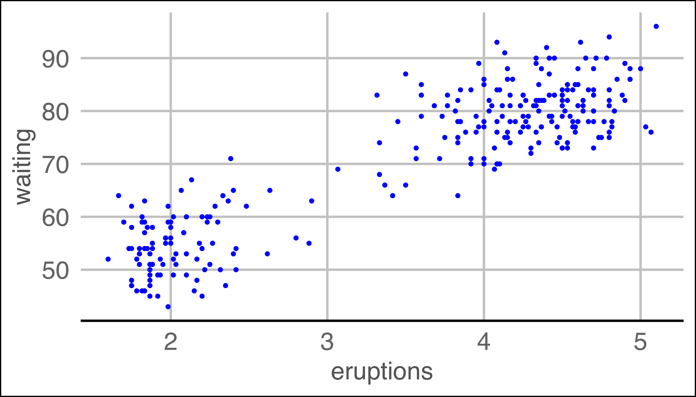
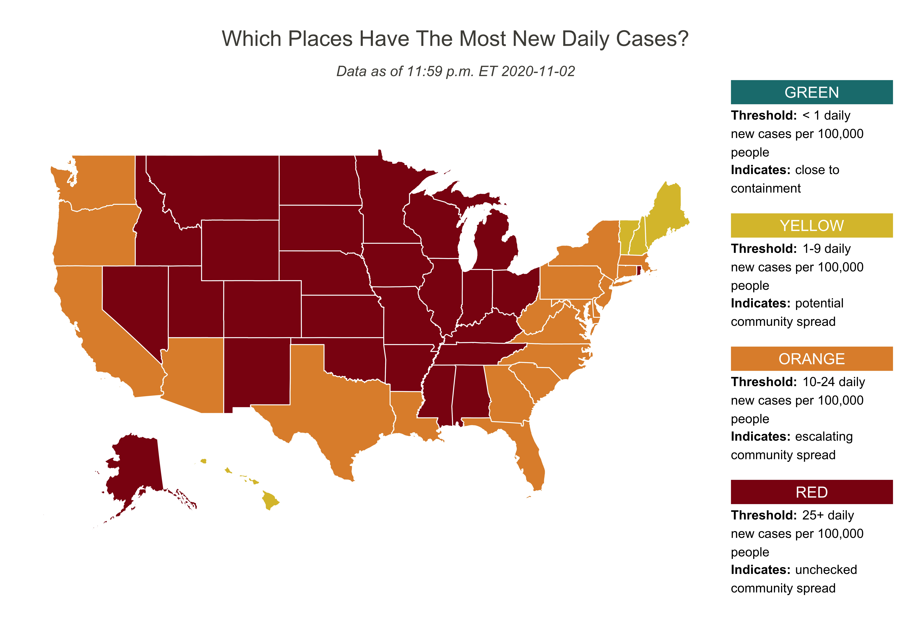
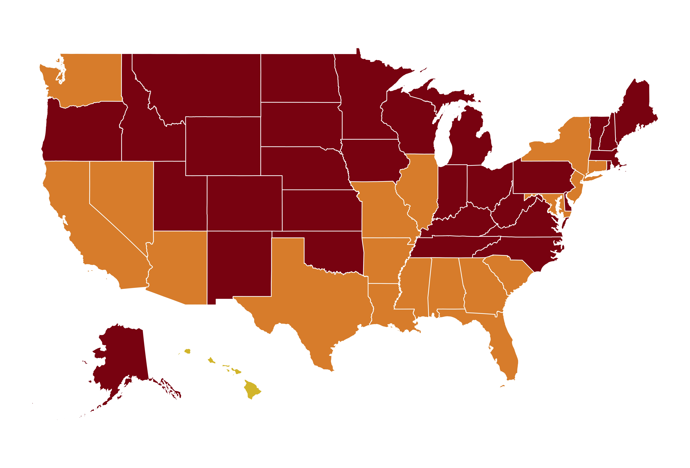
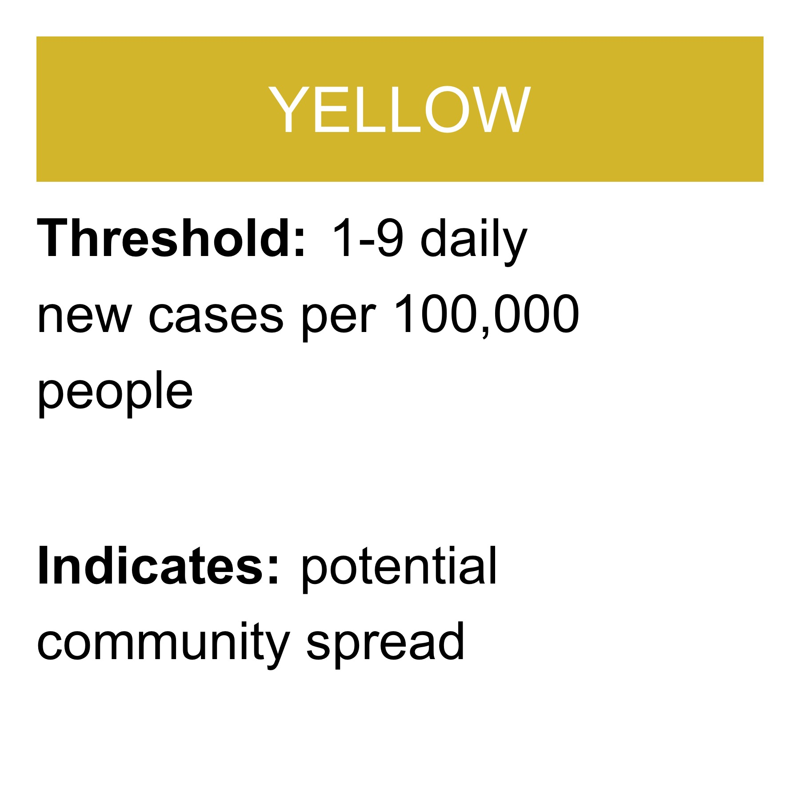
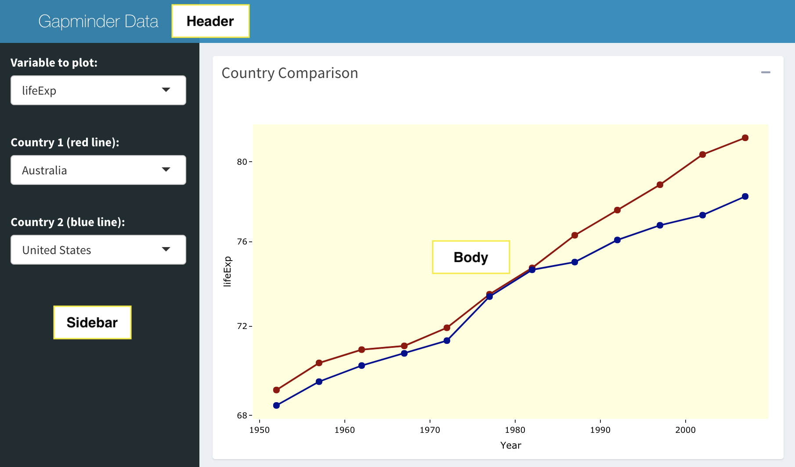
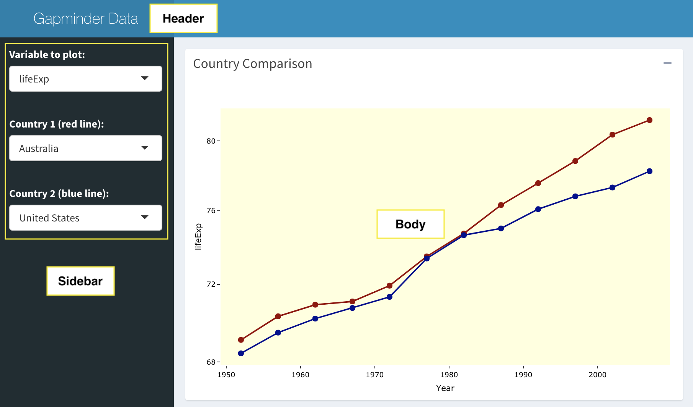
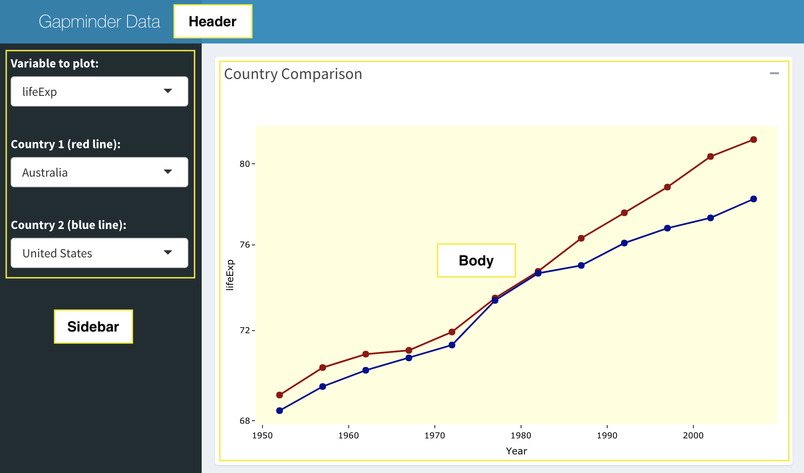
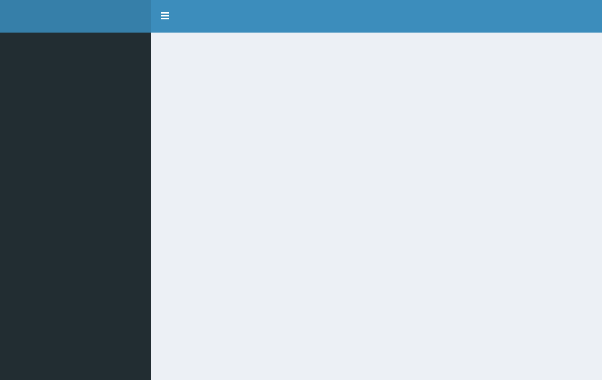
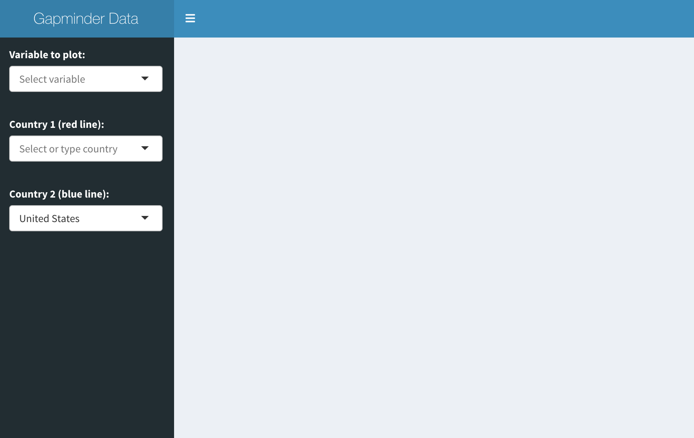
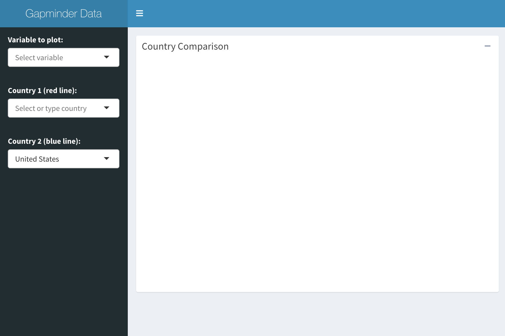

class: center, middle, inverse, title-slide

## Data Visualization with R
#### Jeremy Mack
#### Lehigh University - Digital Scholarship Team


---
class: center, middle, inverse, title-slide

## Data Visualization with R
#### Jeremy Mack
#### Lehigh University - Digital Scholarship Team
 &nbsp;  &nbsp; 
<br/><br/>
<br/><br/>
<br/>

---
### About this presentation

 * This seminar is the second in a series on R programming, with
   a focus on **data visualization**.

--
 
 * It is targeted at people that have experience programming in R.
 
--
   
 * It could be useful for people who learned R some time ago and
   forgot it, or who are not familiar with modern R programming
   (`tidyverse`).
   
--
   
 * Slides are available on [Lehigh's Research Computing site](https://confluence.cc.lehigh.edu/display/hpc/Seminars), [Wordpress](https://wordpress.lehigh.edu/jsm4/r-at-lehigh/data-visualization-with-r/), and Github ([slides](https://jeremymack-lu.github.io/rviz/) and [raw code](https://github.com/jeremymack-LU/rviz))

---
### Structure of the presentation

The presentation is split into four topics:

 * [**Topic 1:**](https://jeremymack-lu.github.io/rviz/#8) The (layered) Grammar of Graphics
 
 * [**Topic 2:**](https://jeremymack-lu.github.io/rviz/#75) Static visualizations
 
 * [**Topic 3:**](https://jeremymack-lu.github.io/rviz/#100) Dynamic visualizations
 
 * [**Topic 4:**](https://jeremymack-lu.github.io/rviz/#124) Shiny Apps

---
class: center, middle, inverse

#### Topic 1: The (layered) Grammar of Graphics
<br/><br/>
<br/><br/>
<br/><br/>
<br/><br/>
<br/><br/>
<br/><br/>

---
#### Topic 1: The (layered) Grammar of Graphics

Visualizing data in R

<center><b>“The simple graph has brought more information to the data analyst’s mind than any other device.” - John Tukey</b></center>

<center></center>

---
#### Topic 1: The (layered) Grammar of Graphics

Visualizing data in R

<center><b>“The simple graph has brought more information to the data analyst’s mind than any other device.” - John Tukey</b></center>
<br/>
<center></center>

---
#### Topic 1: The (layered) Grammar of Graphics
.pull-left2[
* *The Grammar of Gaphics*

* Structure of data graphics.

* Foundation for modern applications.
  + **ggplot2**
  
  + Tableau
  
  + Vega-Lite]

.pull-right2[
<center></center>]

---
#### Topic 1: The (layered) Grammar of Graphics
.pull-left2[
* Tidyverse - **ggplot2**

* Implementation of the grammar
]

.pull-right2[
<center></center>]

---
#### Topic 1: The (layered) Grammar of Graphics
.pull-left2[
* Tidyverse - **ggplot2**

* Implementation of the grammar

* Layered approach to building graphics
]

.pull-right2[
<center></center>]

---
#### Topic 1: The (layered) Grammar of Graphics
.pull-left2[
* Tidyverse - **ggplot2**

* Implementation of the grammar

* Layered approach to building graphics
 + Required arguments
 
 + Sensible defaults
]

.pull-right2[
<center></center>
<center></center>
]

---
#### Topic 1: The (layered) Grammar of Graphics
.pull-left2[
* Tidyverse - **ggplot2**

* Implementation of the grammar

* Layered approach to building graphics
 + Required arguments
 
 + Sensible defaults
 
* Basic template has three functions:
  + **ggplot** - creates a blank canvas
  
  + **geom** - adds a layer
  
  + **aes** - visual properties of an object
]

.pull-right2[
<center></center>
<center></center>
]

---
class: center, middle, inverse

#### Topic 2: Static visualizations
#### "Old Faithful"
<br/><br/>
<br/><br/>
<br/><br/>
<br/><br/>
<br/><br/>

---
##### Topic 2: Static visualizations
<style>
  pre {
    background-color: lightyellow;
    white-space: pre-wrap;
    line-height: 100%;
  }
</style>
.pull-right2[
<center></center>
]

.tiny2.pull-left2[
* Old Faithful dataset:
  {{content}}
]

--
  + Geyser in Yellowstone National Park
  
  + Eruption time in minutes (*eruptions*)
  
  + Time until next eruption (*waiting*)
  {{content}}

--

```{r comment=NA}
head(faithful, 5)
```
{{content}}

--

```{r comment=NA}
str(faithful)
```
{{content}}

---
#### Topic 2: Static visualizations
.right-column2[
<center></center>
<center></center>
]

.left-column2[
* Create a blank ggplot canvas:
```{r echo=FALSE, message=FALSE, warning=FALSE}
library(ggplot2)
```
.tiny[
```{r eval=FALSE}
ggplot(data=faithful)
```
]
]

---
#### Topic 2: Static visualizations

<center></center>

---
#### Topic 2: Static visualizations
.right-column2[
<center></center>
<center></center>
]

.left-column2[
* Create a blank ggplot canvas:
.tiny[
```{r eval=FALSE}
ggplot(data=faithful)
```
]
* Add a geometric (geom) object layer and map variables to **aes**thetics:
.tiny[
```{r eval=FALSE}
ggplot(data=faithful) +
geom_point(mapping=aes(
             x=eruptions,
             y=waiting))
```
]
]

---
#### Topic 2: Static visualizations

<center></center>

---
#### Topic 2: Static visualizations
.right-column2[
<center></center>
<center></center>
]

.left-column2[
* Layered approach to building graphics
{{content}}
]

--

* Some things to remember:
 {{content}}

--

 + Multiple ways to map variables
   {{content}}

---
#### Topic 2: Static visualizations
.right-column2[
<center></center>
<center></center>
]

.tiny.left-column2[
* Split mappings:
```{r eval=FALSE}
ggplot(data=faithful) +
geom_point(mapping=aes(
             x=eruptions,
             y=waiting))
```
{{content}}
]

--

* Mappings in **ggplot** function:
```{r eval=FALSE}
ggplot(data=faithful,
       mapping=aes(
         x=eruptions,
         y=waiting)) +
geom_point()
```
{{content}}

--

* Mappings in **geom** function:
```{r eval=FALSE}
ggplot() +
geom_point(data=faithful,
           mapping=aes(
             x=eruptions,
             y=waiting))
```
{{content}}

---
#### Topic 2: Static visualizations
.right-column2[
<center></center>
<center></center>
]

.tiny.left-column2[
* Create a blank ggplot canvas:
```{r eval=FALSE}
ggplot(data=faithful)
```

* Add a geometric (geom) object layer and map variables to **aes**thetics:
```{r eval=FALSE}
ggplot(data=faithful) +
geom_point(mapping=aes(
             x=eruptions,
             y=waiting))
```
{{content}}
]

--

* Add another **aes**thetics:
```{r eval=FALSE}
ggplot(data=faithful) +
geom_point(mapping=aes(
             x=eruptions,
             y=waiting,
             color=eruptions < 3)))
```
{{content}}

---
#### Topic 2: Static visualizations

<center></center>

---
#### Topic 2: Static visualizations
.right-column2[
<center></center>
<center></center>
]

.left-column2[
* Layered approach to building graphics

* Some things to remember:

 + Multiple ways to map variables
   {{content}}

]

--

 + Multiple ways to change aesthetics
   {{content}}

---
#### Topic 2: Static visualizations
.right-column2[
<center></center>
<center></center>
]

.tiny.left-column2[
* Mapping a color:
```{r eval=FALSE}
ggplot(data=faithful) +
geom_point(mapping=aes(
             x=eruptions,
             y=waiting,
             color=eruptions < 3))
```
{{content}}
]

--

* Setting a color:
```{r eval=FALSE}
ggplot(data=faithful) +
geom_point(mapping=aes(
             x=eruptions,
             y=waiting),
             color='blue')
```
{{content}}

---
#### Topic 2: Static visualizations

<center></center>

---
#### Topic 2: Static visualizations

.right-column2[
<center></center>
<center></center>
]

.tiny.left-column2[
* Add another geom ("stacking layers"):
```{r eval=FALSE}
ggplot(data=faithful,
       mapping=aes(
         x=eruptions,
         y=waiting)) +
geom_point() +
geom_smooth(method="lm")
```
]

---
#### Topic 2: Static visualizations

<center></center>

---
#### Topic 2: Static visualizations
.right-column2[
<center></center>
<center></center>
]

.left-column2[
* Layered approach to building graphics

* Some things to remember:

 + Multiple ways to map variables

 + Multiple ways to change aesthetics
   {{content}}

]

--

 + Order matters
 {{content}}

---
#### Topic 2: Static visualizations

.right-column2[
<center></center>
<center></center>
]

.tiny.left-column2[
* Add another geom ("stacking layers"):
```{r eval=FALSE}
ggplot(data=faithful,
       mapping=aes(
         x=eruptions,
         y=waiting)) +
geom_point() +
geom_smooth(method="lm")
```
{{content}}
]

--

```{r eval=FALSE}
ggplot(data=faithful,
       mapping=aes(
         x=eruptions,
         y=waiting)) +
geom_smooth(method="lm") +
geom_point()
```
{{content}}

---
#### Topic 2: Static visualizations

<center></center>

---
#### Topic 2: Static visualizations
.right-column2[
<center></center>
<center></center>
]

.left-column2[
* Layered approach to building graphics

* Some things to remember:

 + Multiple ways to map variables

 + Multiple ways to change aesthetics

 + Order matters
   {{content}} 

]

--

 + Many types of geoms, different mapping requirements
 {{content}}

---
#### Topic 2: Static visualizations

<center></center>

---
class: center, middle, inverse

#### Topic 2: Static visualizations
#### ggplot2 extensions
<br/><br/>
<br/><br/>
<br/><br/>
<br/><br/>
<br/><br/>

---
#### Topic 2: Static visualizations
.right-column2[
<center>
]

.left-column2[
* **ggplot2** extensions

* Extends the grammar of graphics
{{content}}
]

--

 + Developed by R users
  {{content}}

--
  
 + Provides additional [functionality](<http://exts.ggplot2.tidyverse.org/gallery/>)
  {{content}}

---
#### Topic 2: Static visualizations
.right-column2[
<center>
]

.left-column2[
* **ggplot2** extensions - **patchwork**

* Extends the grammar of graphics
{{content}}
]

--

 + Arranging multiple plots
  {{content}}

--
  
 + Many approaches
  {{content}}
     - Facets
     - gridExtra::grid.arrange()
     - ggpubr::ggarrange()
     - cowplot::plot_grid()
     - patchwork

---
#### Topic 2: Static visualizations
.tiny.left-column3[
* Establish plots:
```{r eval=FALSE}
library(patchwork)

pw1 <- ggplot(data=faithful,
       mapping=aes(
         x=eruptions,
         y=waiting)) +
  geom_point()

pw2 <- ggplot(data=faithful,
       mapping=aes(
         x=eruptions,
         y=waiting)) +
  geom_point() +
  geom_smooth(method="lm")
```
]

--

.tiny.right-column3[
* Patchwork together:
```{r eval=FALSE}
# Side by side
pw1 + pw2
```
{{content}}
]

---
#### Topic 2: Static visualizations

<center></center>

---
#### Topic 2: Static visualizations
.tiny.left-column3[
* Establish plots:
```{r eval=FALSE}
library(patchwork)

pw1 <- ggplot(data=faithful,
       mapping=aes(
         x=eruptions,
         y=waiting)) +
  geom_point()

pw2 <- ggplot(data=faithful,
       mapping=aes(
         x=eruptions,
         y=waiting)) +
  geom_point() +
  geom_smooth(method="lm")
```
]

.tiny.right-column3[
* Patchwork together:
```{r eval=FALSE}
# Side by side
pw1 + pw2

# Stacked
pw1 / pw2
```
{{content}}
]

---
#### Topic 2: Static visualizations

<center></center>

---
#### Topic 2: Static visualizations
.tiny.left-column3[
* Establish plots:
```{r eval=FALSE}
library(patchwork)

pw1 <- ggplot(data=faithful,
       mapping=aes(
         x=eruptions,
         y=waiting)) +
  geom_point()

pw2 <- ggplot(data=faithful,
       mapping=aes(
         x=eruptions,
         y=waiting)) +
  geom_point() +
  geom_smooth(method="lm")

pw3 <- ggplot(data=faithful,
       mapping=aes(
         x=eruptions)) +
  geom_histogram()
```
]

.tiny.right-column3[
* Patchwork together:
```{r eval=FALSE}
# Side by side
pw1 + pw2

# Stacked
pw1 / pw2

# Three figures
(pw1 + pw2) / pw3
```
{{content}}
]

---
#### Topic 2: Static visualizations

<center></center>

---
#### Topic 2: Static visualizations
.right-column2[
<center>
]

.left-column2[
* **ggplot2** extensions - **ggforce/ggthemes**

* Extends the grammar of graphics
{{content}}
]

--

 + Provides extra geoms, scales, and themes
  {{content}}
  
---
#### Topic 2: Static visualizations
.right-column2[
<center>
]

.tiny.left-column2[
* **ggplot2** extensions - **ggforce/ggthemes**

* Extends the grammar of graphics

 + Provides extra geoms, scales, and themes
 
 + Microsoft Excel theme
```{r eval=FALSE}
ggplot(data=faithful) +
geom_point(mapping=aes(
             x=eruptions,
             y=waiting),
             color='blue') +
theme_excel()
```
]

---
#### Topic 2: Static visualizations

<center></center>

---
#### Topic 2: Static visualizations
.right-column2[
<center>
]

.tiny.left-column2[
* **ggplot2** extensions - **ggforce/ggthemes**

* Extends the grammar of graphics

 + Provides extra geoms, scales, and themes
 
 + Microsoft Excel theme
 
 + Wall Street Journal theme
```{r eval=FALSE}
ggplot(data=faithful) +
geom_point(mapping=aes(
             x=eruptions,
             y=waiting),
             color='blue') +
#theme_excel()
theme_wsj()
```
]

---
#### Topic 2: Static visualizations

<center></center>

---
#### Topic 2: Static visualizations
.right-column2[
<center>
]

.tiny.left-column2[
* **ggplot2** extensions - **ggforce/ggthemes**

* Extends the grammar of graphics

 + Provides extra geoms, scales, and themes
 
 + Microsoft Excel theme
 
 + Wall Street Journal theme
 
 + Google Docs theme
```{r eval=FALSE}
ggplot(data=faithful) +
geom_point(mapping=aes(
             x=eruptions,
             y=waiting),
             color='blue') +
#theme_excel()
#theme_wsj()
theme_gdocs()
```
]

---
#### Topic 2: Static visualizations

<center></center>

---
class: center, middle, inverse

#### Topic 2: Static visualizations
#### ggplot2 and simple features (sf) data
<br/><br/>
<br/><br/>
<br/><br/>
<br/><br/>
<br/><br/>

---
#### Topic 2: Static visualizations
.right-column2[
<center>
]

.left-column2[
* Simple features (**sf**) data

* Introduces a new type of object to work with spatial data
{{content}}
]
  
---
#### Topic 2: Static visualizations
<style>
  pre {
    background-color: lightyellow;
    white-space: pre-wrap;
    line-height: 100%;
  }
</style>
.right-column2[
<center>
]

.left-column2[
* Simple features (**sf**) data

* Introduces a new type of object to work with spatial data

 + Non-spatial data + Spatial data
 {{content}}
]

--

 + Attributes + Geometries
 {{content}}

---
class: center, middle, inverse

#### Comparison of sf and non-sf spatial data
<br/><br/>
<br/><br/>
<br/><br/>
<br/><br/>
<br/><br/>

---
#### Topic 2: Static visualizations
.right-column5[
* Spatial data in data frame
```{r echo=FALSE}
library(usmap)
```

.tiny7[
```{r}
library(usmap) # State and county data non-sf
non_sf <- us_map(regions="states"); head(non_sf, 5); str(non_sf)
```
]
]

.left-column5[
* Spatial data in an sf object
```{r echo=FALSE}
library(urbnmapr)
```

.tiny7[
```{r}
library(urbnmapr) # State and county shapefiles in sf
states_sf <- get_urbn_map("states", sf = TRUE); print(states_sf)
```
]
]

---
#### Topic 2: Static visualizations

<center></center>

---
#### Topic 2: Static visualizations

.pull-right2[
<center>
]

.tiny2.pull-left2[
Necessary datasets:
{{content}}
]

--
 * Spatial data: state boundaries
  
 * Non-spatial data: cases of COVID-19
 
 * Non-spatial data: state populations
  {{content}}

---
#### Topic 2: Static visualizations
.right-column2[
<center>
]

.left-column2[
* Spatial data: state boundaries
```{r echo=FALSE}
library(urbnmapr)
```

.tiny5[
```{r}
library(urbnmapr) # State and county shapefiles in sf
states_sf <- get_urbn_map("states", sf = TRUE); print(states_sf)
```
]
]

---
#### Topic 2: Static visualizations
.left-column2[
* Non-spatial data: cases of COVID-19
]
<br/><br/>
.tiny5[
```{r echo=FALSE}
ts <- "https://raw.githubusercontent.com/CSSEGISandData/COVID-19/master/csse_covid_19_data/csse_covid_19_time_series/time_series_covid19_confirmed_US.csv"
ts <- read.csv(ts, sep=",", header=TRUE)
```

```{r eval=FALSE}
ts <- "https://raw.githubusercontent.com/CSSEGISandData/COVID-19/master/csse_covid_19_data/csse_covid_19_time_series/time_series_covid19_confirmed_US.csv"
ts <- read.csv(ts, sep=",", header=TRUE)
str(ts[1:14])
```
]

.tiny5[
```{r echo=FALSE}
str(ts[1:12])
```
]

---
#### Topic 2: Static visualizations
.right-column2[
<center>
]

.left-column2[
* Non-spatial data: state populations
```{r echo=FALSE, message=FALSE, warning=FALSE}
library(dplyr)
```
.tiny5[
```{r}
pop <- 
  "https://drive.google.com/uc?open&id=1gAdOoa097FFAkNIgriG0bX2iAPNpXXIS"
pop <- read.csv(pop, sep=",", header=TRUE)
pop <- pop %>% mutate(population=as.numeric(gsub(",","",population)))
names(pop)[1] <- "state_name"
head(pop)
```
]
]

---
#### Topic 2: Static visualizations
.left-column4[
* Load necessary packages

.tiny3[
```{r message=FALSE, warning=FALSE}
library(patchwork)  # Combine plots
library(sf)         # Simple features
library(dplyr)      # Tidyverse grammar
library(tidyr)      # Cleaning data
library(zoo)        # Time series functions
library(ggplot2)    # Plotting
```
]
]

.right-column4[
* Time series data clean up

.tiny3[
```{r}
ts <- ts %>%
  # Remove unincorporated territories and cruise liners
  filter(iso2=="US") %>%
  filter(!Province_State %in% c("Diamond Princess", 
                                "Grand Princess")) %>%
  # Select id and time series columns
  select(5:7, 12:ncol(.)) %>%
  # Convert from wide to long format
  gather(date, cases, 4:ncol(.), factor_key=TRUE) %>% 
  arrange(FIPS, date) %>% 
  droplevels() %>%
  as.data.frame()
head(ts)
```
]
]

---
#### Topic 2: Static visualizations
.left-column3[
* Data frames for states and dates

.tiny3[
```{r message=FALSE}
# Sum case count by state
states <- ts %>%
  group_by(Province_State, date) %>%
  summarize(cases=sum(cases)) %>%
  as.data.frame()
# Calculate number of records for each state
count <- states %>% 
  group_by(Province_State) %>% 
  summarize(count=length(Province_State))
# Create a date frame of dates
dates <- data.frame(rep(
  seq(as.Date('2020-01-22'),
      as.Date('2020-01-22') + as.numeric(count[1,2]-1),
      by = 'days'),
  times = nrow(count)))
names(dates) <- "date"
```
]
]

.right-column3[
* Merge datasets

.tiny3[
```{r message=FALSE}
# Combine data frames
df.us <- cbind(states, dates)
df.us <- df.us[,c(1,4,3)]
names(df.us)[1] <- "state_name"
df.us <- df.us %>%
  group_by(state_name) %>%
  mutate(new=cases-lag(cases, default=0)) %>%
  mutate(new7=rollapply(new,7,mean,fill=0,align="right"))
head(df.us)
```
]
]

---
#### Topic 2: Static visualizations
.left-column3[
* Subset and calculate incidence

.tiny3[
```{r message=FALSE}
df.us2 <- df.us %>%
  group_by(state_name) %>%
  arrange(date) %>%
  slice(n()) %>%
  right_join(pop, by="state_name") %>%
  mutate(new7b=round(new7/(population/100000),1))
```
]
]

.right-column3[
* Merge attributes and geometries

.tiny3[
```{r message=FALSE}
states_sf <- states_sf %>% 
  right_join(df.us2, by="state_name")
```
]

.tiny7[
```{r message=FALSE, echo=FALSE}
states_sf$new7 <- round(states_sf$new7,1)
head(states_sf[3:9],3)
```
]
]

---
#### Topic 2: Static visualizations

.pull-right2[
<center>
]

.tiny2.pull-left2[
Necessary datasets:
 * Spatial data: state boundaries
  
 * Non-spatial data: cases of COVID-19
 
 * Non-spatial data: state populations
{{content}}
]

--

<br/>

Parts of the plot:
  
 * Map
 
 * Legend (custom)
  {{content}}

---
#### Topic 2: Static visualizations
* Parts of the plot: Map
.tiny2[
```{r eval=FALSE}
# Create bins based on incidence value
states_sf <- states_sf %>%
  cut(new7b,
      breaks=c(0,0.9,9.5,24.5,1000),
      labels=c("A","B","C","D"))
# Custom colors (Green, Yellow, Orange, and Red)
cols <- c("A"="#197d7d", "B"="#dbc037", "C"="#e08f38", "D"="#8C1111")
# Create map
usa <- ggplot() +
  geom_sf(data=states_sf, aes(fill=bin),
          size=0.25, color="white") +
  scale_fill_manual(values=cols) +
  theme_void() +
  theme(legend.position="none",
        text=element_text(color="#22211d"),
        plot.background=element_rect(fill="white", color=NA),
        panel.background=element_rect(fill="white", color=NA))
```
]

---
#### Topic 2: Static visualizations

<center></center>

---
#### Topic 2: Static visualizations
* Parts of the plot: Map - updated coordinate reference system (CRS)
.tiny2[
```{r eval=FALSE}
# Create map
usa2 <- ggplot() +
  geom_sf(data=states_sf, aes(fill=bin),
          size=0.25, color="white") +
  scale_fill_manual(values=cols) +
# Update the coordinate reference system
  coord_sf(crs=st_crs(3857)) +
  theme_void() +
  theme(legend.position="none",
        text=element_text(color="#22211d"),
        plot.background=element_rect(fill="white", color=NA), 
        panel.background=element_rect(fill="white", color=NA))
```
]

---
#### Topic 2: Static visualizations

<center></center>

---
#### Topic 2: Static visualizations
* Parts of the plot: Legend (custom)
.tiny2[
```{r eval=FALSE}
# Create a legend item as another plot using annotate
leg.R <- ggplot() +
  annotate(geom="rect", xmin=0, xmax=2, ymin=1.8, ymax=2, color=NA, fill="#8C1111") +
  annotate(geom="text", label="RED", x=1, y=1.9, color="white", size=3) +
  annotate(geom="text",
           label="Threshold:",
           x=0, hjust=0, y=1.75, vjust=1, size=2.5, fontface="bold") +
  annotate(geom="text",
           label="                    25+ daily\nnew cases per 100,000\npeople",
           x=0, hjust=0, y=1.75, vjust=1, size=2.5) +
  annotate(geom="text",
           label="Indicates:",
           x=0, hjust=0, y=1.3, vjust=1, size=2.5, fontface="bold") +
  annotate(geom="text",
           label="                  unchecked\ncommunity spread",
           x=0, hjust=0, y=1.3, vjust=1, size=2.5) +
  scale_y_continuous(limits=c(1,2)) +
  theme_void() +
  theme(text=element_text(color="#22211d"),
        plot.background=element_rect(fill="white", color=NA),
        panel.background=element_rect(fill="white", color=NA),
        legend.background=element_rect(fill="white", color=NA)
  )
```
]

---
#### Topic 2: Static visualizations





---
#### Topic 2: Static visualizations
* Combining parts of the plot using patchwork
.tiny2[
```{r eval=FALSE}
# Create a legend item as another plot using annotate
usa2 + (leg.G/leg.Y/leg.O/leg.R) + plot_layout(widths = c(4, 1)) + 
  plot_annotation(
    title='Which Places Have The Most New Daily Cases?',
    subtitle=paste("Data as of 11:59 p.m. ET", Sys.Date()-1)) & 
  theme(plot.title=element_text(size= 12, hjust=0.5, color="#4e4d47",
                                margin=margin(b = -0.1, t = 0.4, l = 2, unit = "cm")),
        plot.subtitle=element_text(size=8, hjust=0.5, color="#4e4d47", face="italic",
                                   margin=margin(b = -0.1, t = 0.4, l = 2, unit = "cm")))
```
]

---
#### Topic 2: Static visualizations

<center></center>

---
class: inverse

#### Review - static visualizations:
* Grammar of graphics - basis for many data visualization programs.

--

* **ggplot2** is a popular implementation.

 * Layered approach with sensible defaults.
 
 
   <center></center>

--

* Extension packages expand **ggplot2** capabilities.

--

* **sf** data makes working with spatial data more efficient.

---
class: center, middle, inverse

#### Topic 3: Dynamic visualizations
#### "Life expectency"
<br/><br/>
<br/><br/>
<br/><br/>
<br/><br/>
<br/><br/>

---
#### Topic 3: Dynamic visualizations
.pull-right2[
<center></center>
]

.tiny2.pull-left2[
* Life expectency (**gapminder**) dataset:
  {{content}}
]

--
  + Data from the Gapminder foundation
  
  + Geography (*country* and *continent*)
  
  + Life expectency (*lifeExp*)
  
  + Economic data (*gdpPercap*)
  
  + Time (*year*)

---
#### Topic 3: Dynamic visualizations
.pull-right2[
<center></center>
]

.pull-left2[
* Life expectency (**gapminder**) dataset:

  + Data from the Gapminder foundation
  
  + Geography (*country* and *continent*)
  
  + Life expectency (*lifeExp*)
  
  + Economic data (*gdpPercap*)
  
  + Time (*year*)
]

<br/><br/>
<br/><br/>
<br/><br/>
<br/><br/>
<br/><br/>
<br/><br/>

.tiny3[
```{r echo=FALSE}
library(gapminder)
```

```{r comment=NA}
str(gapminder)
```
]

---
#### Topic 3: Dynamic visualizations

<center></center>

---
#### Topic 3: Dynamic visualizations
.right-column2[
<center>
]

.left-column2[
* **ggplot2** extensions - **gganimate**

* Extends the grammar of graphics
{{content}}
]

--

  + New grammar classes
  {{content}}

--
  
  + How a plot should change with time
  {{content}}

---
#### Topic 3: Dynamic visualizations
.tiny[
```{r eval=FALSE}
# Use the gapminder dataset in ggplot
ggplot(data=gapminder,
       aes(x=gdpPercap, y=lifeExp, size=pop, color=country)) +
# Add a point geom
 geom_point(alpha=0.7, show.legend=FALSE)
```
]

---
#### Topic 3: Dynamic visualizations

<center></center>

---
#### Topic 3: Dynamic visualizations
.tiny[
```{r eval=FALSE}
# Use the gapminder dataset in ggplot
ggplot(data=gapminder,
       aes(x=gdpPercap, y=lifeExp, size=pop, color=country)) +
  # Add a point geom
 geom_point(alpha=0.7, show.legend=FALSE) +
```

```{r eval=FALSE}
# Add some manual scaling and facets 
 scale_colour_manual(values=country_colors) +
 scale_size(range=c(2, 12)) +
 scale_x_log10() +
 facet_wrap(~continent, nrow=1)
```
]

---
#### Topic 3: Dynamic visualizations

<center></center>

---
#### Topic 3: Dynamic visualizations
.tiny[
```{r eval=FALSE}
# Use the gapminder dataset in ggplot
ggplot(data=gapminder,
       aes(x=gdpPercap, y=lifeExp, size=pop, color=country)) +
# Add a point geom
 geom_point(alpha=0.7, show.legend=FALSE) +
```

```{r eval=FALSE}
# Add some manual scaling and facets
 scale_colour_manual(values=country_colors) +
 scale_size(range=c(2, 12)) +
 scale_x_log10() +
 facet_wrap(~continent, nrow=1) +
```

```{r eval=FALSE}
# Animate figure with gganimate package
 transition_time(year) +
 ease_aes('linear') +
 labs(title='Year: {frame_time}', 
      x='GDP per capita', 
      y='Life expectancy')
```
]

---
#### Topic 3: Dynamic visualizations

<center></center>

---
#### Topic 3: Dynamic visualizations
.right-column2[
<center>
]

.left-column2[
* **ggplot2** integration - **plotly**

* Extends the grammar of graphics
{{content}}
]

--

  + Creates interactive web graphics
  {{content}}

--
  
  + Customizable user interface
  {{content}}

---
#### Topic 3: Dynamic visualizations
```{r echo=FALSE, warning=FALSE, message=FALSE, comment=NA}
library(plotly)
library(widgetframe)
theme <- theme(panel.background=element_rect(color="black", fill="lightyellow", size=0.25),
               panel.grid=element_blank(),
               plot.title=element_text(size=9, color="black"),
               strip.background=element_rect(color="black", size=0.25),
               axis.ticks=element_line(size=0.25),
               axis.text=element_text(size=7, color="black"),
               axis.title=element_text(size=8, color="black"),
               legend.title=element_text(size=8, color="black"),
               legend.text=element_text(size=7, color="black"),
               legend.justification="top",
               legend.key=element_rect(color="black", fill="lightyellow", size=0.1))

p9 <- ggplot(data=gapminder, 
             aes(x=gdpPercap, y=lifeExp, size=pop, color=continent)) +
  # Add a point geom
  geom_point(alpha=0.7, show.legend=FALSE, aes(frame = year, ids = country)) +
  # Add some manual scaling
  scale_colour_manual(values=continent_colors) +
  scale_size(range=c(2, 12)) +
  scale_x_log10() +
  labs(x='GDP per capita', 
       y='Life expectancy at birth') +
  theme

fig <- ggplotly(p9, height=500, width=750) %>%
  animation_opts(
    1000, easing = "linear", redraw = FALSE) %>%
  animation_slider(
    currentvalue=list(prefix="YEAR ",
                      font=list(color="red"),
                      xanchor='left',
                      yanchor='top')) %>%
  animation_button(
    x = 1, xanchor = "right", y = -0.2, yanchor = "bottom"
  )

frameWidget(fig, height=500, width=750)
```

---
#### Topic 3: Dynamic visualizations
.tiny[
```{r eval=FALSE}
library(plotly)
plot <- ggplot(data=gapminder, 
             aes(x=gdpPercap, y=lifeExp, size=pop, color=continent)) +
  # Add a point geom
  geom_point(alpha=0.7, show.legend=FALSE, aes(frame = year, ids = country)) +
  # Add some manual scaling
  scale_colour_manual(values=continent_colors) +
  scale_size(range=c(2, 12)) +
  scale_x_log10() +
  labs(x='GDP per capita', 
       y='Life expectancy at birth')
```
]

--

.tiny[
```{r eval=FALSE}
fig <- ggplotly(plot, height=500, width=750) %>%
  animation_opts(
    1000, easing = "linear", redraw = FALSE) %>%
  animation_slider(
    currentvalue=list(prefix="YEAR ",
                      font=list(color="red"),
                      xanchor='left',
                      yanchor='top')) %>%
  animation_button(
    x = 1, xanchor = "right", y = -0.2, yanchor = "bottom"
  )
```
]

---
#### Topic 3: Dynamic visualizations
```{r echo=FALSE, warning=FALSE, message=FALSE, comment=NA}
library(plotly)
library(widgetframe)
theme <- theme(panel.background=element_rect(color="black", fill="lightyellow", size=0.25),
               panel.grid=element_blank(),
               plot.title=element_text(size=9, color="black"),
               strip.background=element_rect(color="black", size=0.25),
               axis.ticks=element_line(size=0.25),
               axis.text=element_text(size=7, color="black"),
               axis.title=element_text(size=8, color="black"),
               legend.title=element_text(size=8, color="black"),
               legend.text=element_text(size=7, color="black"),
               legend.justification="top",
               legend.key=element_rect(color="black", fill="lightyellow", size=0.1))

p9 <- ggplot(data=gapminder, 
             aes(x=gdpPercap, y=lifeExp, size=pop, color=continent)) +
  # Add a point geom
  geom_point(alpha=0.7, show.legend=FALSE, aes(frame = year, ids = country)) +
  # Add some manual scaling
  scale_colour_manual(values=continent_colors) +
  scale_size(range=c(2, 12)) +
  scale_x_log10() +
  labs(x='GDP per capita', 
       y='Life expectancy at birth') +
  theme

fig <- ggplotly(p9, height=500, width=750) %>%
  animation_opts(
    1000, easing = "linear", redraw = FALSE) %>%
  animation_slider(
    currentvalue=list(prefix="YEAR ",
                      font=list(color="red"),
                      xanchor='left',
                      yanchor='top')) %>%
  animation_button(
    x = 1, xanchor = "right", y = -0.2, yanchor = "bottom"
  )

frameWidget(fig, height=500, width=750)
```

---
class: inverse

#### Review - dynamic visualizations:
* Grammar of graphics - basis for many data visualization programs.

--

* **ggplot2** is a popular implementation.

 * Extention packages - **gganimate**.
 
 * Intergration packages - **ploltly**.

--

* Create visualizations that are dynamic and interactive.

---
class: center, middle, inverse

#### Topic 4: Shiny Apps
<br/><br/>
<br/><br/>
<br/><br/>
<br/><br/>
<br/><br/>
<br/><br/>

---
#### Topic 4: Shiny Apps
.right-column2[
<center>
]

.left-column2[
* [RStudio](<https://shiny.rstudio.com/>) product - **shiny**

* Create interative web applications with R
{{content}}
]

--

* Three components:
{{content}}

--

 1. a user interface object (ui)
{{content}}
--

 2. a server function (server)
{{content}}
--

 3. a call to the **shinyApp** function
{{content}}

---
#### Topic 4: Shiny Apps

[<center></center>](https://shiny.cc.lehigh.edu/jsm4/gapminder)

---
#### Topic 4: Shiny Apps
.right-column2[
<center>
]

.left-column2[
* User interface object (ui)
{{content}}
]

--

* Determines how the application will look and function
{{content}}

--

* Three components: 
 {{content}}

--

 1. Layout
{{content}}


---
#### Topic 4: Shiny Apps

<center></center>

---
#### Topic 4: Shiny Apps
.right-column2[
<center>
]

.left-column2[
* User interface object (ui)

* Determines how the application will look and function
 
* Three components:

 1. Layout
 
 2. User inputs
]

---
#### Topic 4: Shiny Apps

<center></center>

---
#### Topic 4: Shiny Apps
.right-column2[
<center>
]

.left-column2[
* User interface object (ui)

* Determines how the application will look and function
 
* Three components:

 1. Layout
 
 2. User inputs
 
 3. Visible content
]
 
---
#### Topic 4: Shiny Apps

<center></center>

---
#### Topic 4: Shiny Apps
.right-column2[
<center>
]

.left-column2[
* Server function (server)
{{content}}
]

--

* Creates *outputs* from *inputs* (i.e., reactive programming)
{{content}}

--
 
* Three parameters:
{{content}}

--

 1. Input
 {{content}}
 
--
 
 2. Output
 {{content}}
 
--
 
 3. Session
 {{content}}
 
---
#### Topic 4: Shiny Apps

<center></center>

---
#### Topic 4: Shiny Apps
.tiny[
* Load necessary packages:
```{r eval=FALSE}
library(shiny)           # Shiny package   
library(gapminder)       # Dataset
library(tidyverse)       # Tidyverse, including ggplot and dplyr
library(shinydashboard)  # Shiny dashboard layout
library(plotly)          # Plotly package
```
]
---
#### Topic 4: Shiny Apps
```{r echo=FALSE, warning=FALSE, message=FALSE}
library(tidyverse)
library(gapminder)
df <- gapminder
df <- df %>% as.data.frame()
```

.tiny[
* Define data:
```{r eval=FALSE}
# Load gapminder data
df <- gapminder
df <- df %>% as.data.frame()

# Create dataframe of country names 
df.countries <- df %>% select(country) %>% unique()
head(df.countries)
```

```{r echo=FALSE, comment=NA}
# Create dataframe of country names 
df.countries <- df %>% select(country) %>% unique()
head(df.countries)
```
]

---
#### Topic 4: Shiny Apps
.tiny2[
* Base Shiny app:
```{r eval=FALSE}
ui <- dashboardPage(
    dashboardHeader(),
    dashboardSidebar(),
    dashboardBody())

server <- function(input, output, session){}

shinyApp(ui, server)
```
]

---
#### Topic 4: Shiny Apps

<center></center>

---
#### Topic 4: Shiny Apps
.tiny2[
* Define ui function:
```{r eval=FALSE}
ui <- dashboardPage(
    dashboardHeader(title="Gapminder Data"),
    dashboardSidebar(),
    dashboardBody()
)
```
]

---
#### Topic 4: Shiny Apps

<center></center>

---
#### Topic 4: Shiny Apps
.tiny2[
* Define ui function:
```{r eval=FALSE}
ui <- dashboardPage(
    dashboardHeader(title="Gapminder Data"),
    dashboardSidebar(
        varSelectizeInput(),
        selectizeInput(),
        selectizeInput()
  ),
    dashboardBody()
)
```
]

---
#### Topic 4: Shiny Apps
.tiny2[
* Define ui function:
```{r eval=FALSE}
ui <- dashboardPage(
    dashboardHeader(title="Gapminder Data"),
    dashboardSidebar(
        varSelectizeInput(inputId='variable',
                          label='Variable to plot:',
                          data=df[,4:6],
                          options=list(placeholder='Select variable',
                                       onInitialize=I('function() { this.setValue(""); }'))),
        selectizeInput(),
        selectizeInput(),
    dashboardBody()
)
```
]

---
#### Topic 4: Shiny Apps
.tiny2[
* Define ui function:
```{r eval=FALSE}
ui <- dashboardPage(
    dashboardHeader(title="Gapminder Data"),
    dashboardSidebar(
        varSelectizeInput(inputId='variable',
                          label='Variable to plot:',
                          data=df[,4:6],
                          options=list(placeholder='Select variable',
                                       onInitialize=I('function() { this.setValue(""); }'))),
        selectizeInput(inputId='country1',
                       label='Country 1 (red line):',
                       choices=df.countries,
                       options=list(placeholder='Select or type country',
                                    onInitialize=I('function() { this.setValue(""); }'))),
        selectizeInput(),
    dashboardBody()
)
```
]

---
#### Topic 4: Shiny Apps
.tiny2[
* Define ui function:
```{r eval=FALSE}
ui <- dashboardPage(
    dashboardHeader(title="Gapminder Data"),
    dashboardSidebar(
        varSelectizeInput(inputId='variable',
                          label='Variable to plot:',
                          data=df[,4:6],
                          options=list(placeholder='Select variable',
                                       onInitialize=I('function() { this.setValue(""); }'))),
        selectizeInput(inputId='country1',
                       label='Country 1 (red line):',
                       choices=df.countries,
                       options=list(placeholder='Select or type country',
                                    onInitialize=I('function() { this.setValue(""); }'))),
        selectizeInput(inputId='country2',
                       label='Country 2 (blue line):',
                       choices=df.countries,
                       options=list(placeholder='Select or type country',
                                    onInitialize=I('function() { this.setValue("United States"); }'))
                       )),
    dashboardBody()
)
```
]

---
#### Topic 4: Shiny Apps

<center></center>

---
#### Topic 4: Shiny Apps
.tiny2[
* Define ui function:
```{r eval=FALSE}
ui <- dashboardPage(
    dashboardHeader(title="Gapminder Data"),
    dashboardSidebar(
        varSelectizeInput(inputId='variable',
                          label='Variable to plot:',
                          data=df[,4:6],
                          options=list(placeholder='Select variable',
                                       onInitialize=I('function() { this.setValue(""); }'))),
        selectizeInput(inputId='country1',
                       label='Country 1 (red line):',
                       choices=df.countries,
                       options=list(placeholder='Select or type country',
                                    onInitialize=I('function() { this.setValue(""); }'))),
        selectizeInput(inputId='country2',
                       label='Country 2 (blue line):',
                       choices=df.countries,
                       options=list(placeholder='Select or type country',
                                    onInitialize=I('function() { this.setValue("United States"); }')))),
    dashboardBody(
            box(title="Country Comparison",
                solidHeader=TRUE,
                width=12,
                collapsible=TRUE,
                plotlyOutput('plot1')))
)
```
]

---
#### Topic 4: Shiny Apps

<center></center>

---
#### Topic 4: Shiny Apps
.tiny2[
* Define server function:
```{r eval=FALSE}
server <- function(input, output) {}
```
]

---
#### Topic 4: Shiny Apps
.tiny2[
* Define server function:
```{r eval=FALSE}
server <- function(input, output) {
    # Subset data based on Country 1 selection
    df.sub1 <- reactive({
        req(input$country1)
        df %>% filter(country==input$country1) %>% select(year, !!input$variable)})
}
```
]

---
#### Topic 4: Shiny Apps
.tiny2[
* Define server function:
```{r eval=FALSE}
server <- function(input, output) {
    # Subset data based on Country 1 selection
    df.sub1 <- reactive({
        req(input$country1)
        df %>% filter(country==input$country1) %>% select(year, !!input$variable)})
    # Subset data based on Country 2 selection
    df.sub2 <- reactive({
        req(input$country2)
        df %>% filter(country==input$country2) %>% select(year, !!input$variable)})
}
```
]

---
#### Topic 4: Shiny Apps
.tiny2[
* Define server function:
```{r eval=FALSE}
server <- function(input, output) {
    # Subset data based on Country 1 selection
    df.sub1 <- reactive({
        req(input$country1)
        df %>% filter(country==input$country1) %>% select(year, !!input$variable)})
    # Subset data based on Country 2 selection
    df.sub2 <- reactive({
        req(input$country2)
        df %>% filter(country==input$country2) %>% select(year, !!input$variable)})
    # Plot variables
    output$plot1 <- renderPlotly({
        df1   <- df.sub1()
        df2   <- df.sub2()
        plot1 <- ggplot() + 
            geom_point(data=df1, color="darkred",
                       aes_string(x=names(df1)[1], y=names(df1)[2])) +
            geom_line(data=df1, color="darkred",
                      aes_string(x=names(df1)[1], y=names(df1)[2])) +
            geom_point(data=df2, color="darkblue",
                       aes_string(x=names(df2)[1], y=names(df2)[2])) +
            geom_line(data=df2, color="darkblue",
                      aes_string(x=names(df2)[1], y=names(df2)[2])) +
            labs(x = "Year", y = names(df1)[2]) +
            scale_y_log10()
        ggplotly(plot1)})
}
```
]

---
#### Topic 4: Shiny Apps

[<center></center>](https://shiny.cc.lehigh.edu/jsm4/gapminder)

---
class: inverse

#### Review - Shiny Apps:
* Interactive web applications built with R.

--

* Three components:

--

 1. a user interface object (ui)

--

 2. a server function (server)

--

 3. a call to the **shinyApp** function

--

* Reactive programming different than writing script

---
class: inverse

#### Review - Resources:
* RStudio (and user contributed) cheatsheets - [link](https://rstudio.com/resources/cheatsheets/)

--

* Data visualization (**ggplot**)

 * *R for Data Science* by Hadley Wickham and Garret Grolemund - [link](https://r4ds.had.co.nz/index.html)
 
--
 
 * Thomas Lin Pedersen ggplot2 presentation (YouTube), Part 1 - [link](https://www.youtube.com/watch?v=h29g21z0a68)
 
 * Thomas Lin Pedersen ggplot2 presentation (YouTube), Part 2 - [link](https://www.youtube.com/watch?v=0m4yywqNPVY)
 
--

* Shiny Apps

 * *Mastering Shiny* by Hadley Wickham - [link](https://mastering-shiny.org)
 
 * RStudio tutortials - [link](https://shiny.rstudio.com/tutorial/)
 
---
class: center, middle, inverse, title-slide

## Questions?
