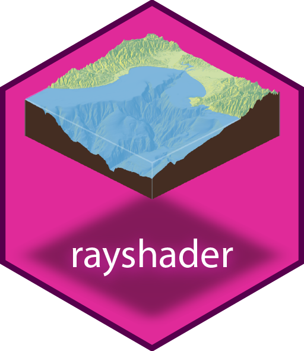
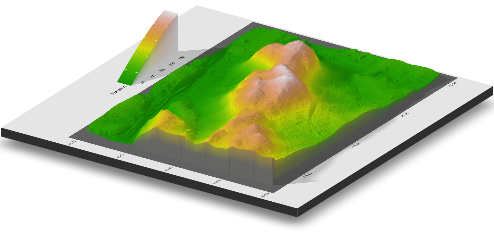
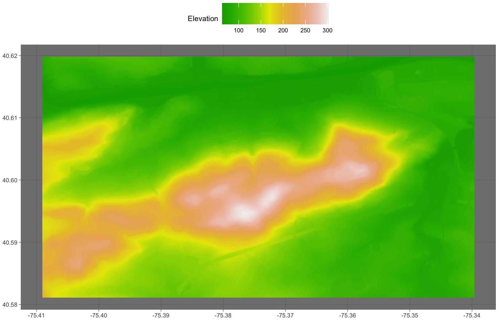
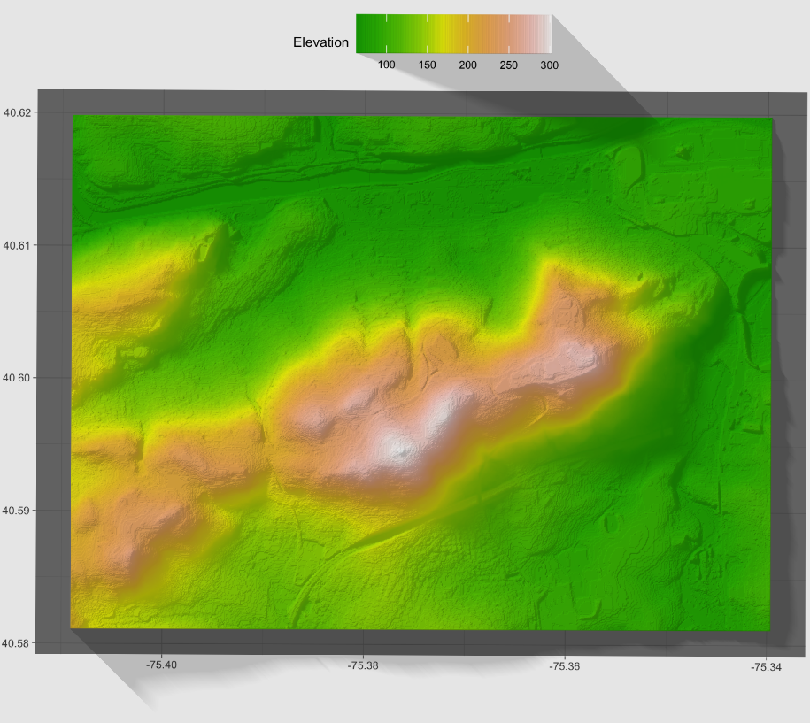
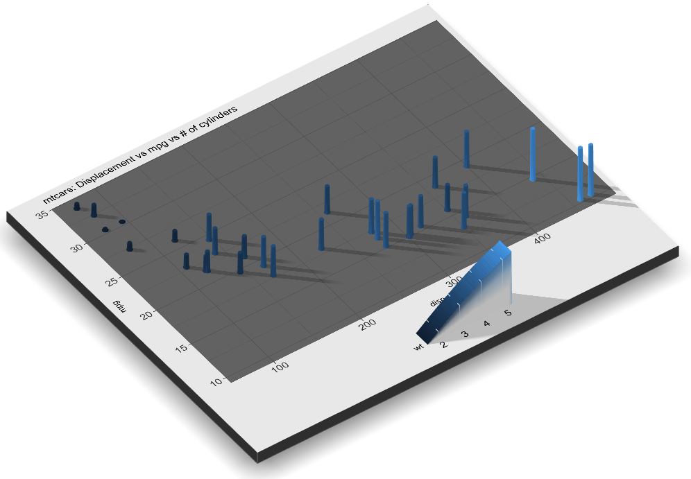

class: center, middle, inverse
<style>
  pre {
    background-color: lightyellow;
    white-space: pre-wrap;
    line-height: 100%;
  }
</style>

#### Topic 3: Dynamic visualizations
#### "Life expectency"
<br/><br/>
<br/><br/>
<br/><br/>
<br/><br/>
<br/><br/>

---
#### Topic 3: Dynamic visualizations

.right-column2[
<center>
]

.left-column2[
* **ggplot2** integrations - **rayshader**

* Extends the grammar of graphics

  + Translates ggplot2 objects into 3D
  
  + Models can be rotated and examined interactively
]

---
#### Topic 3: Dynamic visualizations

<center></center>

---
#### Topic 3: Dynamic visualizations

.tiny2[
* Create ggplot object with raster data (digital elevation model)

```{r eval=FALSE, warning=FALSE, message=FALSE, comment=NA}
# Load necessary packages
pacman::p_load(tidyverse, raster, ggthemes, sp, sf, rasterVis, rayshader)

# Read raster dataset from url and convert to data frame
url      <- "https://github.com/jeremymack-LU/rviz/blob/master/data/smtn_dem_clip.tif?raw=true"
r.dem    <- raster::raster(url)
r.df     <- raster::as.data.frame(r.dem, xy=TRUE)
# Drop NAs and rename raster grid cell variable
r.df     <- r.df %>% drop_na() %>% rename(elevation=3)

# Create ggplot2 object
r.plot <- ggplot() +
    geom_raster(data=r.df,
                aes(x=x, y=y, fill=elevation),
                interpolate=TRUE,
                show.legend=TRUE) +
    scale_fill_gradientn(name = "Elevation", colors=terrain.colors(10)) +
    coord_quickmap() +
    theme_dark(base_size=6) +
    theme(axis.title=element_blank(),
        legend.position='top',
        legend.direction='horizontal')
```
]

---
#### Topic 3: Dynamic visualizations

<center></center>

---
#### Topic 3: Dynamic visualizations

.tiny2[
* Pass ggplot object to rayshader

```{r eval=FALSE, warning=FALSE, message=FALSE, comment=NA}
# Pass ggplot2 object to rayshader function
plot_gg(r.plot,
        multicore=TRUE,
        width=5,
        height=5,
        scale=200,
        windowsize=c(1400,866),
        zoom=0.55,
        phi=30)
# Capture snapshot of the rgl window
render_snapshot(filename = "smtn_3D", clear=TRUE)
```
]

---
#### Topic 3: Dynamic visualizations

<center></center>

---
#### Topic 3: Dynamic visualizations

.tiny2.left-column7[
* Create ggplot object
```{r eval=FALSE, warning=FALSE, message=FALSE, comment=NA}
# Load viridis package
library(viridis)
# Plot using mtcars dataset
gg_cars <- ggplot(mtcars) + 
  geom_point(aes(x=disp, y=mpg, color=wt), size=2) +
  scale_fill_viridis("Weight") +
  ggtitle("mtcars: Displacement vs mpg vs # of cylinders") +
  theme_dark() +
  theme(title = element_text(size=8),
        text = element_text(size=12),
        legend.position = 'bottom') 
```
]

.tiny2.right-column7[
* Pass to rayshader
```{r eval=FALSE, warning=FALSE, message=FALSE, comment=NA}
# Pass ggplot2 object to rayshader function
plot_gg(gg_cars,
        multicore=TRUE,
        width=6,
        height=5,
        scale=250,
        windowsize=c(1400,866),
        zoom=0.55,
        phi=30)
# Capture snapshot of the rgl window
render_snapshot(filename = "mtcars",
                clear=TRUE)
```
]

---
#### Topic 3: Dynamic visualizations

<center></center>

---
class: inverse

#### Review - Dynamic visualizations:
* Dynamic visualization created with **ggplot2** extensions and integrations

* **gganimate** is a popular extension for animating graphs

 * Adds new grammar to ggplot2

* **rayshader** is a popular integration for creating 3D objects

  * Uses ggplot objects as required arguments
<br/><br/><br/><br/>
.pull-right3[


]
