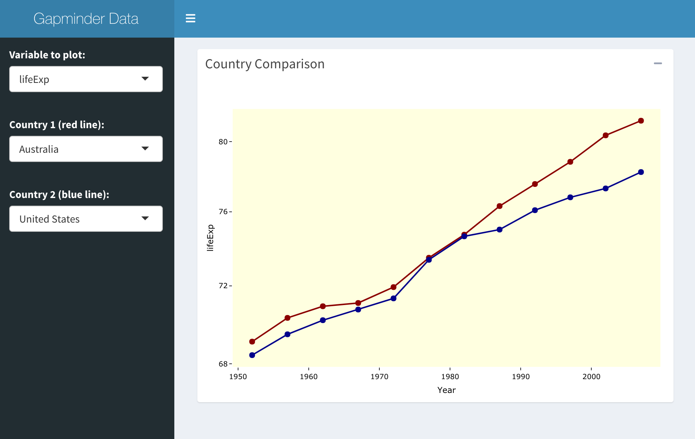

class: center, middle, inverse, title-slide

## Data Visualization with R
#### Alex Pacheco and Jeremy Mack
#### March 20, 2020
<br/><br/>
<br/><br/>
<br/><br/>
<br/><br/>

---
class: center, middle, inverse

#### Topic 4: Shiny Apps
<br/><br/>
<br/><br/>
<br/><br/>
<br/><br/>
<br/><br/>
<br/><br/>

---
#### Topic 4: Shiny Apps
.right-column2[
<center>
]

.left-column2[
* [RStudio](<https://shiny.rstudio.com/>) product - **shiny**

* Create interative web applications with R
{{content}}
]

--

* Three components:
{{content}}

--

 1. a user interface object (ui)
{{content}}
--

 2. a server function (server)
{{content}}
--

 3. a call to the **shinyApp** function
{{content}}

---
#### Topic 4: Shiny Apps
.right-column2[
<center>
]

.left-column2[
* [RStudio](<https://shiny.rstudio.com/>) product - **shiny**

* Create interative web applications with R

* Three components:

 1. a user interface object (ui)

 2. a server function (server)

 3. a call to the **shinyApp** function
 
.tiny2[
```{r eval=FALSE}
ui <- dashboardPage(
    dashboardHeader(),
    dashboardSidebar(),
    dashboardBody())

server <- function(input, output, session){}

shinyApp(ui, server)
```
]

]

---
#### Topic 4: Shiny Apps

[<center></center>](https://shiny.cc.lehigh.edu/jsm4/gapminder)

---
#### Topic 4: Shiny Apps
.right-column2[
<center>
]

.left-column2[
* User interface object (ui)
{{content}}
]

--

* Determines how the application will look and function
{{content}}

--

* Three components: 
 {{content}}

--

 1. Layout
{{content}}


---
#### Topic 4: Shiny Apps

<center></center>

---
#### Topic 4: Shiny Apps
.right-column2[
<center>
]

.left-column2[
* User interface object (ui)

* Determines how the application will look and function
 
* Three components:

 1. Layout
 
 2. User inputs
]

---
#### Topic 4: Shiny Apps

<center></center>

---
#### Topic 4: Shiny Apps
.right-column2[
<center>
]

.left-column2[
* User interface object (ui)

* Determines how the application will look and function
 
* Three components:

 1. Layout
 
 2. User inputs
 
 3. Visible content
]
 
---
#### Topic 4: Shiny Apps

<center></center>

---
#### Topic 4: Shiny Apps
.right-column2[
<center>
]

.left-column2[
* Server function (server)
{{content}}
]

--

* Creates *outputs* from *inputs* (i.e., reactive programming)
{{content}}

--
 
* Three parameters:
{{content}}

--

 1. Input
 {{content}}
 
--
 
 2. Output
 {{content}}
 
--
 
 3. Session
 {{content}}
 
---
#### Topic 4: Shiny Apps

<center></center>

---
#### Topic 4: Shiny Apps
.tiny[
* Load necessary packages:
```{r eval=FALSE}
library(shiny)           # Shiny package   
library(gapminder)       # Dataset
library(tidyverse)       # Tidyverse, including ggplot and dplyr
library(shinydashboard)  # Shiny dashboard layout
library(plotly)          # Plotly package
```
]
---
#### Topic 4: Shiny Apps
```{r echo=FALSE, warning=FALSE, message=FALSE}
library(tidyverse)
library(gapminder)
df <- gapminder
df <- df %>% as.data.frame()
```

.tiny[
* Define data:
```{r eval=FALSE}
# Load gapminder data
df <- gapminder
df <- df %>% as.data.frame()

# Create dataframe of country names 
df.countries <- df %>% select(country) %>% unique()
head(df.countries)
```

```{r echo=FALSE, comment=NA}
# Create dataframe of country names 
df.countries <- df %>% select(country) %>% unique()
head(df.countries)
```
]
---
#### Topic 4: Shiny Apps
.tiny2[
* Define ui function:
```{r eval=FALSE}
ui <- dashboardPage()
```
]

---
#### Topic 4: Shiny Apps
.tiny2[
* Define ui function:
```{r eval=FALSE}
ui <- dashboardPage(
    dashboardHeader(),
    dashboardSidebar(),
    dashboardBody()
)
```
]

---
#### Topic 4: Shiny Apps

<center></center>

---
#### Topic 4: Shiny Apps
.tiny2[
* Define ui function:
```{r eval=FALSE}
ui <- dashboardPage(
    dashboardHeader(title="Gapminder Data"),
    dashboardSidebar(),
    dashboardBody()
)
```
]

---
#### Topic 4: Shiny Apps

<center></center>

---
#### Topic 4: Shiny Apps
.tiny2[
* Define ui function:
```{r eval=FALSE}
ui <- dashboardPage(
    dashboardHeader(title="Gapminder Data"),
    dashboardSidebar(
        varSelectizeInput(),
        selectizeInput(),
        selectizeInput()
  ),
    dashboardBody()
)
```
]

---
#### Topic 4: Shiny Apps
.tiny2[
* Define ui function:
```{r eval=FALSE}
ui <- dashboardPage(
    dashboardHeader(title="Gapminder Data"),
    dashboardSidebar(
        varSelectizeInput(inputId='variable',
                          label='Variable to plot:',
                          data=df[,4:6],
                          options=list(placeholder='Select variable',
                                       onInitialize=I('function() { this.setValue(""); }'))),
        selectizeInput(),
        selectizeInput(),
    dashboardBody()
)
```
]

---
#### Topic 4: Shiny Apps
.tiny2[
* Define ui function:
```{r eval=FALSE}
ui <- dashboardPage(
    dashboardHeader(title="Gapminder Data"),
    dashboardSidebar(
        varSelectizeInput(inputId='variable',
                          label='Variable to plot:',
                          data=df[,4:6],
                          options=list(placeholder='Select variable',
                                       onInitialize=I('function() { this.setValue(""); }'))),
        selectizeInput(inputId='country1',
                       label='Country 1 (red line):',
                       choices=df.countries,
                       options=list(placeholder='Select or type country',
                                    onInitialize=I('function() { this.setValue(""); }'))),
        selectizeInput(),
    dashboardBody()
)
```
]

---
#### Topic 4: Shiny Apps
.tiny2[
* Define ui function:
```{r eval=FALSE}
ui <- dashboardPage(
    dashboardHeader(title="Gapminder Data"),
    dashboardSidebar(
        varSelectizeInput(inputId='variable',
                          label='Variable to plot:',
                          data=df[,4:6],
                          options=list(placeholder='Select variable',
                                       onInitialize=I('function() { this.setValue(""); }'))),
        selectizeInput(inputId='country1',
                       label='Country 1 (red line):',
                       choices=df.countries,
                       options=list(placeholder='Select or type country',
                                    onInitialize=I('function() { this.setValue(""); }'))),
        selectizeInput(inputId='country2',
                       label='Country 2 (blue line):',
                       choices=df.countries,
                       options=list(placeholder='Select or type country',
                                    onInitialize=I('function() { this.setValue("United States"); }'))
                       )),
    dashboardBody()
)
```
]

---
#### Topic 4: Shiny Apps

<center></center>

---
#### Topic 4: Shiny Apps
.tiny2[
* Define ui function:
```{r eval=FALSE}
ui <- dashboardPage(
    dashboardHeader(title="Gapminder Data"),
    dashboardSidebar(
        varSelectizeInput(inputId='variable',
                          label='Variable to plot:',
                          data=df[,4:6],
                          options=list(placeholder='Select variable',
                                       onInitialize=I('function() { this.setValue(""); }'))),
        selectizeInput(inputId='country1',
                       label='Country 1 (red line):',
                       choices=df.countries,
                       options=list(placeholder='Select or type country',
                                    onInitialize=I('function() { this.setValue(""); }'))),
        selectizeInput(inputId='country2',
                       label='Country 2 (blue line):',
                       choices=df.countries,
                       options=list(placeholder='Select or type country',
                                    onInitialize=I('function() { this.setValue("United States"); }')))),
    dashboardBody(
            box(title="Country Comparison",
                solidHeader=TRUE,
                width=12,
                collapsible=TRUE,
                plotlyOutput('plot1')))
)
```
]

---
#### Topic 4: Shiny Apps

<center></center>

---
#### Topic 4: Shiny Apps
.tiny2[
* Define server function:
```{r eval=FALSE}
server <- function(input, output) {}
```
]

---
#### Topic 4: Shiny Apps
.tiny2[
* Define server function:
```{r eval=FALSE}
server <- function(input, output) {
    # Subset data based on Country 1 selection
    df.sub1 <- reactive({
        req(input$country1)
        df %>% filter(country==input$country1) %>% select(year, !!input$variable)
    })
}
```
]

---
#### Topic 4: Shiny Apps
.tiny2[
* Define server function:
```{r eval=FALSE}
server <- function(input, output) {
    # Subset data based on Country 1 selection
    df.sub1 <- reactive({
        req(input$country1)
        df %>% filter(country==input$country1) %>% select(year, !!input$variable)
    })
    # Subset data based on Country 2 selection
    df.sub2 <- reactive({
        req(input$country2)
        df %>% filter(country==input$country2) %>% select(year, !!input$variable)
    })
}
```
]

---
#### Topic 4: Shiny Apps
.tiny2[
* Define server function:
```{r eval=FALSE}
server <- function(input, output) {
    # Subset data based on Country 1 selection
    df.sub1 <- reactive({
        req(input$country1)
        df %>% filter(country==input$country1) %>% select(year, !!input$variable)
    })
    # Subset data based on Country 2 selection
    df.sub2 <- reactive({
        req(input$country2)
        df %>% filter(country==input$country2) %>% select(year, !!input$variable)
    })
    # Plot variables
    output$plot1 <- renderPlotly({
        df1   <- df.sub1()
        df2   <- df.sub2()
        plot1 <- ggplot() + 
            geom_point(data=df1, color="darkred",
                       aes_string(x=names(df1)[1], y=names(df1)[2])) +
            geom_line(data=df1, color="darkred",
                      aes_string(x=names(df1)[1], y=names(df1)[2])) +
            geom_point(data=df2, color="darkblue",
                       aes_string(x=names(df2)[1], y=names(df2)[2])) +
            geom_line(data=df2, color="darkblue",
                      aes_string(x=names(df2)[1], y=names(df2)[2])) +
            labs(x = "Year", y = names(df1)[2]) +
            scale_y_log10() +
            theme
        ggplotly(plot1)
    })
}
```
]

---
#### Topic 4: Shiny Apps

<center></center>