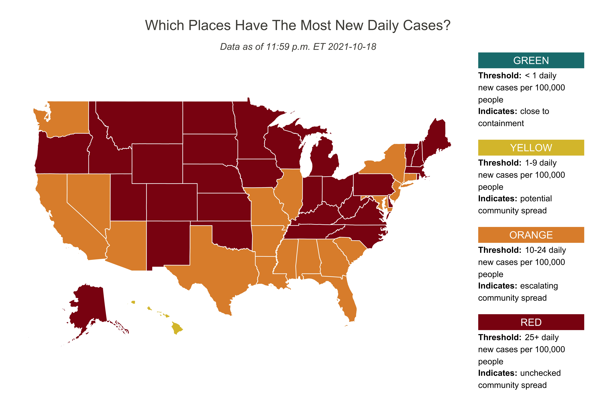
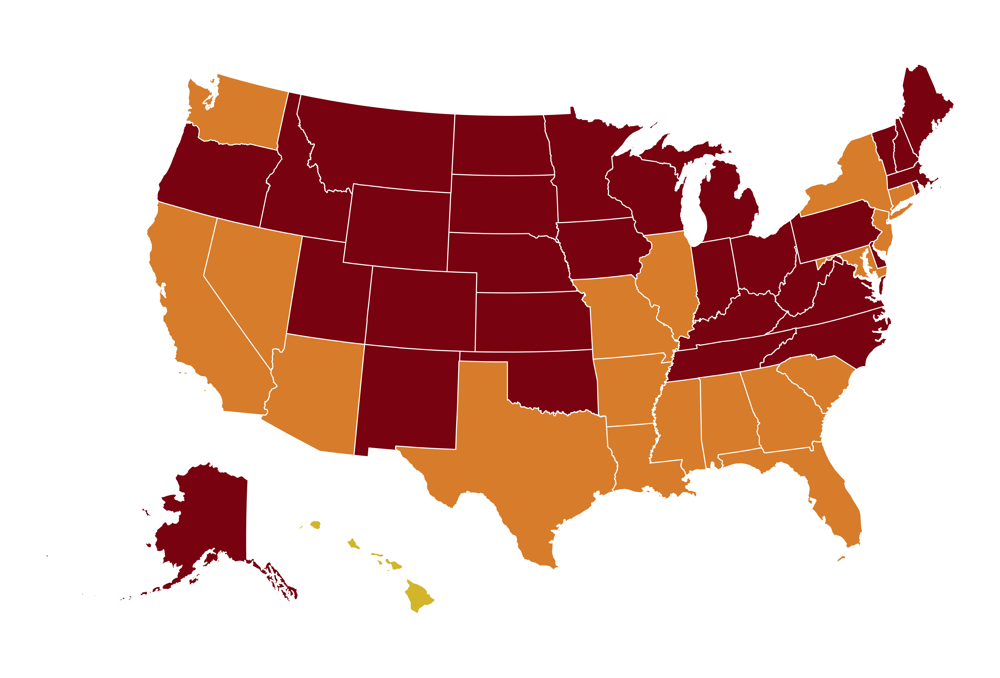

class: center, middle, inverse, title-slide
<style>
  pre {
    background-color: lightyellow;
    white-space: pre-wrap;
    line-height: 100%;
  }
</style>

## Data Visualization with R
#### Jeremy Mack
#### Lehigh University - Digital Scholarship Team


---
class: center, middle, inverse, title-slide

## Data Visualization with R
#### Jeremy Mack
#### Lehigh University - Digital Scholarship Team
 &nbsp;  &nbsp; 
<br/><br/>
<br/><br/>
<br/>

---
#### Topic 2: Static visualizations
.left-column5[
* Spatial data in data frame
```{r include=FALSE}
library(usmap)
library(ggplot2)
library(dplyr)
```

.tiny7[
```{r}
library(usmap) # State and county data non-sf
non_sf <- us_map(regions="states"); head(non_sf, 5); str(non_sf)
```
]
]

--

.right-column5[
* Plot of Pennsylvania
```{r include=FALSE}
library(usmap)
library(ggplot2)
library(dplyr)
```

.tiny7[
```{r eval=FALSE}
non_sf %>% 
  filter(abbr=="PA") %>%
  ggplot() +
  geom_point(aes(x=x,y=y,group=group)) +
  geom_path(aes(x=x,y=y,group=group)) +
  coord_fixed() +
  ggthemes::theme_map()
```
]
<center></center>
]

---
#### Topic 2: Static visualizations
.left-column5b[
* Spatial data in an sf object
```{r include=FALSE}
library(usmap)
library(ggplot2)
library(dplyr)
```

.tiny7[
```{r}
library(urbnmapr) # State and county shapefiles in sf
states_sf <- get_urbn_map("states", sf = TRUE); print(states_sf)
```
]
]

--

.right-column5b[
* Plot of Pennsylvania
```{r include=FALSE}
library(usmap)
library(ggplot2)
library(dplyr)
```

.tiny7[
```{r eval=FALSE}
states_sf %>%
    filter(state_abbv=='PA') %>%
    ggplot() +
    geom_sf() +
    ggthemes::theme_map()
```
]
<center></center>
]

---
#### Topic 2: Static visualizations
.left-column5[
* Spatial data in data frame
```{r echo=FALSE}
library(usmap)
```

.tiny7[
```{r}
library(usmap) # State and county data non-sf
non_sf <- us_map(regions="states"); head(non_sf, 5); str(non_sf)
```
]
]

.right-column5[
* Spatial data in an sf object
```{r echo=FALSE}
library(urbnmapr)
```

.tiny7[
```{r}
library(urbnmapr) # State and county shapefiles in sf
states_sf <- get_urbn_map("states", sf = TRUE); print(states_sf)
```
]
]

---
#### Topic 2: Static visualizations

<center></center>

---
#### Topic 2: Static visualizations

.pull-right2[
<center>
]

.tiny2.pull-left2[
Necessary datasets:

 * Spatial data: state boundaries
  
 * Non-spatial data: cases of COVID-19
 
 * Non-spatial data: state populations
]

---
#### Topic 2: Static visualizations
.right-column2[
<center>
]

.left-column2[
* Spatial data: state boundaries
```{r echo=FALSE}
library(urbnmapr)
```

.tiny5[
```{r}
library(urbnmapr) # State and county shapefiles in sf
states.sf <- get_urbn_map("states", sf = TRUE)
print(states.sf)
```
]
]

---
#### Topic 2: Static visualizations
.tiny5.left-column3[
* Non-spatial data: cases
```{r include=FALSE}
library(readr)
ts <- "https://raw.githubusercontent.com/jeremymack-LU/rviz/master/data/us_covid_ts.csv"
ts <- read_csv(ts)
head(ts)
```

```{r eval=FALSE}
ts <- "https://raw.githubusercontent.com/jeremymack-LU/rviz/master/data/us_covid_ts.csv"
ts <- read_csv(ts)
head(ts)
```

```{r echo=FALSE}
head(ts)
```
]

.tiny5.right-column3[
* Non-spatial data: state populations
```{r include=FALSE}
library(dplyr)
pop <- "https://raw.githubusercontent.com/jeremymack-LU/rviz/master/data/population.csv"
pop <- read_csv(pop)
```

```{r eval=FALSE}
pop <- "https://raw.githubusercontent.com/jeremymack-LU/rviz/master/data/population.csv"
pop <- read_csv(pop)
head(pop)
```

```{r echo=FALSE}
head(pop)
```

```{r}
names(pop)[1] <- "state_name"
head(pop, 2)
```

]

---
#### Topic 2: Static visualizations
.left-column2[
* Merge cases and population datasets
]
<br/><br/>
.tiny5[
```{r message=FALSE}
# Combine data frames
df.us <- ts %>%
  group_by(state_name) %>%
  arrange(date) %>%
  # Select most recent date
  slice(n()) %>%
  left_join(pop, by="state_name") %>%
  # Calculate per capita rate
  mutate(new7b=round(new7/(population/100000),1))
head(df.us)
```
]

---
#### Topic 2: Static visualizations
.left-column2[
* Merge attributes and geometries
]
<br/><br/>
.tiny5[
```{r include=FALSE}
states.sf <- states.sf %>% 
  right_join(df.us, by="state_name")
```

```{r eval=FALSE}
states.sf <- states.sf %>% 
  right_join(df.us, by="state_name")
head(states.sf)
```
]

.tiny5[
```{r message=FALSE, echo=FALSE}
states.sf$new7 <- round(states.sf$new7,1)
head(states.sf,5)
```
]

---
#### Topic 2: Static visualizations

.pull-right2[
<center>
]

.tiny2.pull-left2[
Necessary datasets:
 * Spatial data: state boundaries
  
 * Non-spatial data: cases of COVID-19
 
 * Non-spatial data: state populations
{{content}}
]

--

<br/>

Parts of the plot:
  
 * Map
 
 * Legend (custom)
  {{content}}

---
#### Topic 2: Static visualizations

.left-column2[
* Parts of the plot: Map
]
<br/><br/>

.tiny2[
```{r eval=FALSE}
# Create bins based on incidence value
states.sf <- states.sf %>%
  mutate(bin2=case_when(
        new7b < 1 ~ "A",
        new7b >= 1  & new7b < 10 ~ "B",
        new7b >= 10 & new7b < 25 ~ "C",
        TRUE ~ "D"))
# Custom colors (Green, Yellow, Orange, and Red)
cols <- c("A"="#197d7d", "B"="#dbc037", "C"="#e08f38", "D"="#8C1111")
# Create map
usa <- ggplot() +
  geom_sf(data=states.sf, aes(fill=bin),
          size=0.25, color="white") +
  scale_fill_manual(values=cols) +
  theme_void() +
  theme(legend.position="none",
        text=element_text(color="#22211d"),
        plot.background=element_rect(fill="white", color=NA),
        panel.background=element_rect(fill="white", color=NA))
```
]

---
#### Topic 2: Static visualizations

<center></center>

---
#### Topic 2: Static visualizations

.left-column8[
* Parts of the plot: Map - updated coordinate reference system (CRS)
]
<br/><br/>

.tiny2[
```{r eval=FALSE}
# Create map
usa2 <- ggplot() +
  geom_sf(data=states.sf, aes(fill=bin),
          size=0.25, color="white") +
  scale_fill_manual(values=cols) +
# Update the coordinate reference system
  coord_sf(crs=st_crs(3857)) +
  theme_void() +
  theme(legend.position="none",
        text=element_text(color="#22211d"),
        plot.background=element_rect(fill="white", color=NA), 
        panel.background=element_rect(fill="white", color=NA))
```
]

---
#### Topic 2: Static visualizations

<center></center>

---
#### Topic 2: Static visualizations
.left-column2[
* Parts of the plot: Legend (custom)
]
<br/><br/>

.tiny2[
```{r eval=FALSE}
# Create a legend item as another plot using annotate
leg.R <- ggplot() +
  annotate(geom="rect", xmin=0, xmax=2, ymin=1.8, ymax=2, color=NA, fill="#8C1111") +
  annotate(geom="text", label="RED", x=1, y=1.9, color="white", size=3) +
  annotate(geom="text",
           label="Threshold:",
           x=0, hjust=0, y=1.75, vjust=1, size=2.5, fontface="bold") +
  annotate(geom="text",
           label="                    25+ daily\nnew cases per 100,000\npeople",
           x=0, hjust=0, y=1.75, vjust=1, size=2.5) +
  annotate(geom="text",
           label="Indicates:",
           x=0, hjust=0, y=1.3, vjust=1, size=2.5, fontface="bold") +
  annotate(geom="text",
           label="                  unchecked\ncommunity spread",
           x=0, hjust=0, y=1.3, vjust=1, size=2.5) +
  scale_y_continuous(limits=c(1,2)) +
  theme_void() +
  theme(text=element_text(color="#22211d"),
        plot.background=element_rect(fill="white", color=NA),
        panel.background=element_rect(fill="white", color=NA),
        legend.background=element_rect(fill="white", color=NA))
```
]

---
#### Topic 2: Static visualizations


---
#### Topic 2: Static visualizations

.left-column8[
* Combining parts of the plot using patchwork
]
<br/><br/>

.tiny2[
```{r eval=FALSE}
# Create a legend item as another plot using annotate
usa2 + (leg.G/leg.Y/leg.O/leg.R) + plot_layout(widths = c(4, 1)) + 
  plot_annotation(
    title='Which Places Have The Most New Daily Cases?',
    subtitle=paste("Data as of 11:59 p.m. ET", Sys.Date()-1)) & 
  theme(plot.title=element_text(size= 12, hjust=0.5, color="#4e4d47",
                                margin=margin(b = -0.1, t = 0.4, l = 2, unit = "cm")),
        plot.subtitle=element_text(size=8, hjust=0.5, color="#4e4d47", face="italic",
                                   margin=margin(b = -0.1, t = 0.4, l = 2, unit = "cm")))
```
]

---
#### Topic 2: Static visualizations

<center></center>

---
#### Topic 2: Static visualizations

<center></center>

---
class: inverse

#### Review - Static visualizations:
* Grammar of graphics - basis for many data visualization programs.

--

* **ggplot2** is a popular implementation.

 * Layered approach with sensible defaults.
 
 
   <center></center>

--

* Extension packages expand **ggplot2** capabilities.

--

* **sf** data makes working with spatial data more efficient.